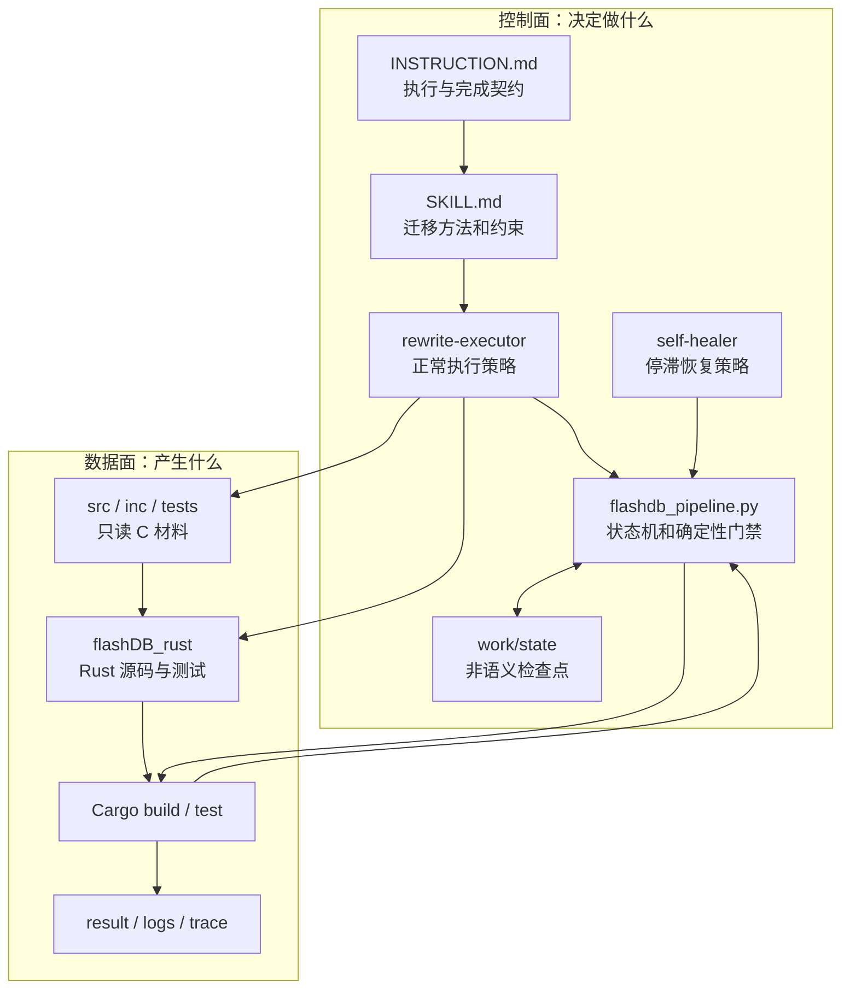
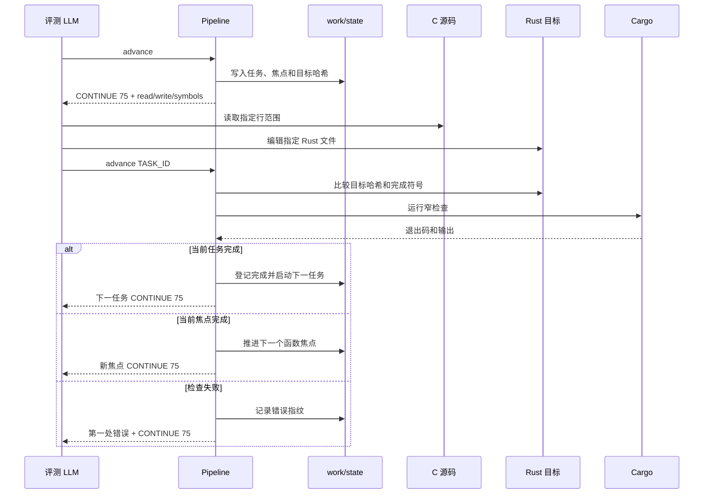
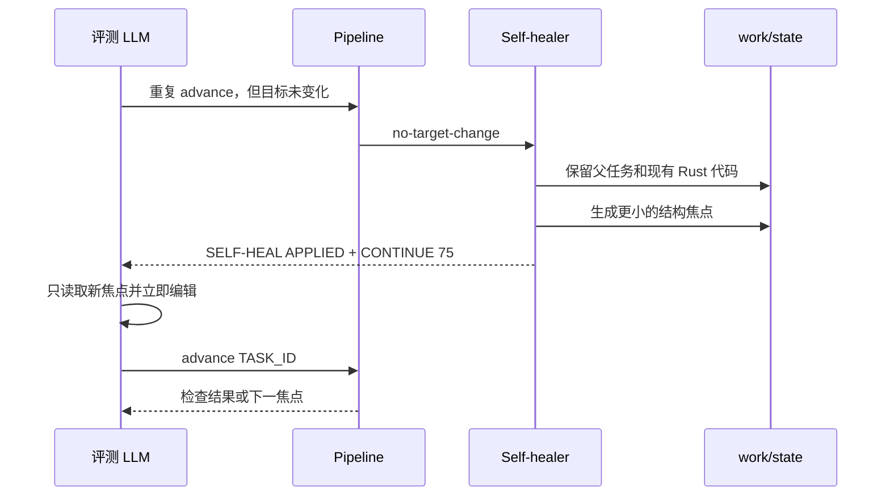
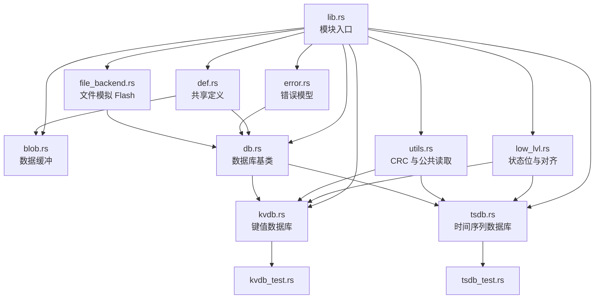
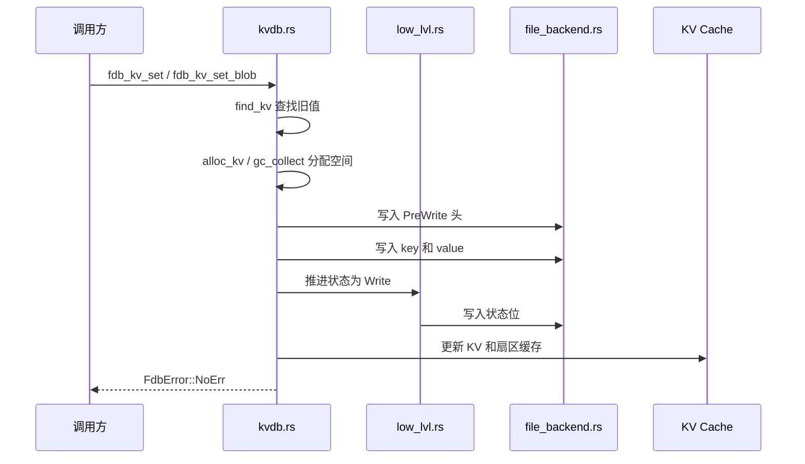
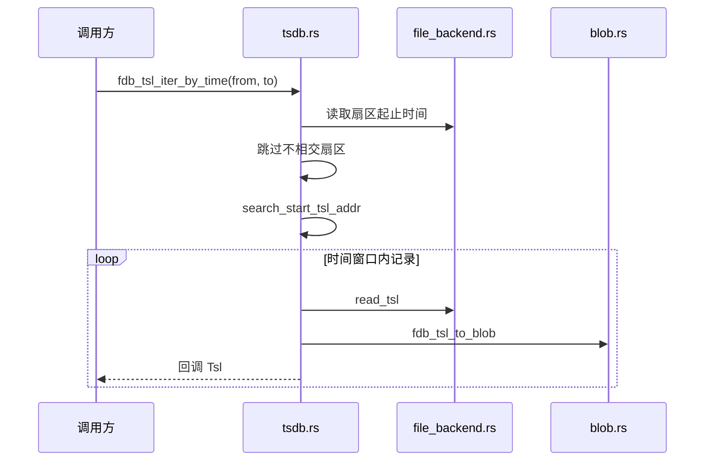
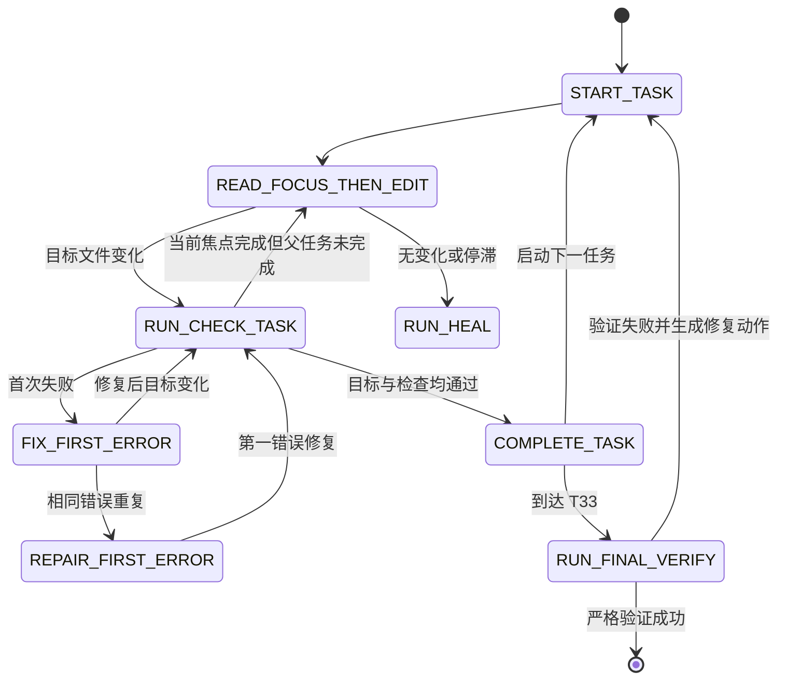

# FlashDB C 到 Rust 自动迁移工程说明

## 目录

1. [文档定位](#1-文档定位)
2. [工程目标](#2-工程目标)
3. [核心工程约束](#3-核心工程约束)
4. [方案设计与架构设计](#4-方案设计与架构设计)
5. [指导产物结构](#5-指导产物结构)
6. [运行时目录](#6-运行时目录)
7. [Rust 工程模块设计](#7-rust-工程模块设计)
8. [微任务系统](#8-微任务系统)
9. [生命周期状态机](#9-生命周期状态机)
10. [`advance` 加速机制](#10-advance-加速机制)
11. [自愈设计](#11-自愈设计)
12. [退出码与完成契约](#12-退出码与完成契约)
13. [标准执行流程](#13-标准执行流程)
14. [严格验证设计](#14-严格验证设计)
15. [参考执行结果](#15-参考执行结果)
16. [维护与扩展](#16-维护与扩展)
17. [故障排查](#17-故障排查)
18. [清理与重新执行](#18-清理与重新执行)
19. [已知边界与工程权衡](#19-已知边界与工程权衡)
20. [交付验收清单](#20-交付验收清单)

## 1. 文档定位

本文面向维护者、评审人员和需要二次开发流水线的工程师，详细说明本作品的目标、架构、状态机、自愈机制、加速策略、验证标准和维护方式。

评测 LLM 的唯一执行入口仍然是根目录的 `INSTRUCTION.md`。评测执行不需要把本文完整加载进上下文；本文用于工程审阅、问题定位和后续演进。

## 2. 工程目标

本作品的核心能力不是只依赖一份预先生成的 Rust 翻译结果，而是提供一套可由评测 LLM 自动执行的迁移系统。发布仓库可以附带一次完整执行结果作为验证样本，但评测仍应在提供的 FlashDB 原始仓库中按指导产物重新执行。系统完成以下工作：

1. 读取 `src/`、`inc/` 和 `tests/` 中的 C 材料，但不修改它们。
2. 在 `flashDB_rust/` 下生成可复现的 Rust 工程。
3. 将 KVDB、TSDB、文件后端、公共数据结构和低层辅助逻辑迁移为 Rust。
4. 将原始 C 测试迁移为 Rust 单元测试和集成测试，或提供行为等价覆盖。
5. 执行 `cargo build` 和 `cargo test`。
6. 检查测试映射、源码完整性和 `unsafe` 比例。
7. 在 `result/`、`logs/` 和 `log/trace/` 中生成可审计记录。

最终 Rust 工程必须至少具有以下结构：

```text
flashDB_rust/
  Cargo.toml
  Cargo.lock
  src/
  tests/
```

## 3. 核心工程约束

### 3.1 原始材料只读

以下目录属于评测输入，任何执行步骤都不得修改：

```text
src/
inc/
tests/
```

严格验证通过 `git diff -- src/ inc/ tests/` 检查这一约束。原始材料有任何差异，整个迁移都判定为失败。

### 3.2 全自动执行

执行过程不得依赖人工确认、交互式终端、手工复制文件或人工选择下一任务。评测 LLM 只需要：

- 运行流水线命令；
- 按流水线给出的精确范围读取 C 源码；
- 编辑指定 Rust 文件；
- 根据状态继续执行。

`logs/interaction/` 仅在确实发生人工交互时创建。正常自动执行中该目录应当不存在。

### 3.3 低上下文运行

系统针对上下文能力较弱的模型设计，禁止一次性加载完整的 `fdb_kvdb.c`、`fdb_tsdb.c` 或完整测试文件。流水线使用微任务、函数级焦点和紧凑续跑包控制单轮输入规模。

### 3.4 可复现交付

交付内容必须包含 Rust 源码、Cargo 配置、测试和执行记录。`flashDB_rust/target/` 属于可再生编译缓存，不是交付件，不应提交。

### 3.5 Rust 安全性

目标实现优先使用所有权、切片、枚举、`Result`、标准文件 API 和明确的数据结构。严格验证要求 Rust 源码中的 `unsafe` 行比例低于 10%；当前参考执行结果为 0%。

## 4. 方案设计与架构设计

### 4.1 先解决什么问题

这个工程同时面对四类问题，不能只把它理解成“把 C 语法翻译成 Rust 语法”：

1. **语义迁移问题**：FlashDB 是面向 Flash 的存储库，包含扇区状态、擦写约束、地址布局、CRC、GC、异常恢复和时间序列索引。语法能编译不代表存储语义一致。
2. **模型上下文问题**：`fdb_kvdb.c`、`fdb_tsdb.c` 和测试文件较长，能力较弱的模型容易在读完源码后触发上下文压缩，随后重复读取，形成无输出循环。
3. **自动执行问题**：评测不允许人工介入。系统必须明确告诉模型下一步读什么、写什么、如何检查，以及什么时候才算真正完成。
4. **结果可信问题**：必须证明 Rust 工程可构建、测试行为与 C 用例对应、原始材料没有被修改，并且交付路径可被自动找到。

因此，方案的重点不是生成一次大提示，而是构造一个**有状态、可恢复、每一步都有确定性门禁的迁移执行系统**。

### 4.2 核心设计思路

#### 思路一：把“理解整个项目”改成“完成当前可验证增量”

系统不要求模型同时理解全部 FlashDB。它先按依赖关系把迁移拆成 44 个微任务，每个任务只暴露：

- 一小段 C 源码；
- 一个或少量 Rust 目标文件；
- 必须出现的完成符号；
- 一个可执行检查命令。

模型的目标从“重写 FlashDB”变成“完成当前函数组并通过检查”。复杂目标被转换为一串短反馈回路。

#### 思路二：让 LLM 负责语义实现，让脚本负责控制与判定

LLM 擅长阅读局部 C 逻辑并写出 Rust；脚本擅长维护状态、计算哈希、执行 Cargo、识别重复错误和生成报告。两者职责明确分离：

| 参与方 | 负责 | 不负责 |
|---|---|---|
| 评测 LLM | 理解当前 C 范围、设计 Rust 表达、编辑代码 | 判断整个队列状态、保存进度、宣布最终完成 |
| Pipeline | 选任务、限范围、存哈希、运行检查、推进状态、最终验证 | 推导 C 算法、偷偷生成实现、保存源码理解 |
| Agent 指导 | 约束执行节奏、定义恢复与自愈行为 | 替代确定性检查 |

这避免让模型同时承担“程序员、调度器、测试平台和项目经理”四种角色。

#### 思路三：状态必须落盘，但源码理解不能落盘

上下文可能随时压缩，所以任务 ID、目标哈希、检查退出码和当前焦点必须持久化。另一方面，把 C 源码总结或算法提示落盘会改变任务性质，也可能导致模型绕过实际阅读。

因此状态分为两类：

- **允许持久化**：结构范围、符号名、哈希、时间戳、错误日志路径、计数器；
- **禁止持久化**：算法总结、翻译伪代码、实现提示、隐藏思维链。

恢复时模型重新读取一个很小的结构范围，而不是读取一份由上一个上下文生成的“答案笔记”。

#### 思路四：中间成功和最终成功必须使用不同语义

普通任务通过只代表当前增量完成，不能让控制器停止。系统用退出码 75 表示“这一步成功，但必须继续”，用严格验证退出码 0 表示“整个迁移完成”。

这解决了自愈命令或单任务检查成功后，外部 Agent 错误结束执行的问题。

#### 思路五：自愈优化当前执行，不重启整个迁移

模型卡住时，最昂贵的做法是清空结果并重新开始。这里的自愈只调整当前任务：缩小源码范围、拆开函数组，或者切换到第一处编译错误。已完成代码和已完成任务始终保留。

### 4.3 备选方案与取舍

| 方案 | 优点 | 主要问题 | 结论 |
|---|---|---|---|
| 单个超长提示一次迁移 | 实现简单 | 上下文溢出、难恢复、无法定位失败 | 不采用 |
| 直接使用机械 C-to-Rust 转译器 | 生成速度快 | 产生大量指针和 `unsafe`，难保证 FlashDB 语义与测试一致 | 仅可作为参考，不作为核心 |
| 每个函数启动一个全新 Agent | 上下文干净 | 重复加载工程背景，跨函数状态难共享，成本高 | 不采用 |
| 用数据库或服务保存任务状态 | 查询能力强 | 引入部署、端口、依赖和评测环境风险 | 不采用 |
| 文件状态 + 单 Python CLI | 零服务、透明、可审计、易恢复 | 需要维护状态格式和结构定位逻辑 | 采用 |
| 每个任务都运行完整测试 | 反馈最可靠 | 运行慢，大量重复测试 | 仅在行为边界和最终验证使用 |
| 只做符号检查 | 速度快 | 可能存在语义空壳 | 作为中间门禁，最终由完整测试兜底 |

最终方案选择“**文件化状态 + 微任务 + LLM 局部实现 + Cargo 门禁 + 最终完整验证**”。

### 4.4 方案输入、处理和输出

```text
输入
  原始 C 源码 + 头文件 + C 测试 + 指导产物
    |
    v
处理
  预检 -> 初始化 Rust 工程 -> 生成任务队列
       -> 局部读取/编辑 -> 增量检查 -> 自愈/推进
       -> 完整构建与测试 -> 完整性与质量验证
    |
    v
输出
  flashDB_rust/ + result/ + logs/ + log/trace/ + work/state/
```

方案提供三类保证：

1. **过程保证**：模型不会被要求一次读取整个核心文件；每次动作都有明确范围和下一步。
2. **恢复保证**：上下文中断后可从磁盘状态继续同一任务，不需要从 T00 重来。
3. **结果保证**：只有完整构建、完整测试、测试映射、`unsafe` 和原始材料完整性全部通过才会生成成功报告。

方案不承诺仅靠符号检查证明语义正确，也不尝试在自愈状态中保存算法答案；这些由测试和模型的真实实现共同完成。

### 4.5 架构分层



系统按职责分为五层：

1. **契约层**：`INSTRUCTION.md` 说明环境准备、执行命令、完成判定和结果位置。
2. **知识层**：Skill 提供 C 到 Rust 的迁移原则、模块边界和上下文纪律。
3. **执行策略层**：Executor 驱动正常循环，Self-healer 处理异常循环。
4. **编排与门禁层**：Pipeline 管理微任务、状态机、哈希、检查、日志和报告。
5. **产物层**：Rust 工程、测试、自验证结果和可审计记录。

### 4.6 控制面与数据面为什么分开

控制面文件可以在不修改 Rust 实现的情况下持续优化执行效率，例如调整焦点阈值、增加诊断类型或改变日志格式。数据面则只负责迁移后的 FlashDB 行为。

这种分离带来三个直接收益：

- 流水线升级不会污染原始 C 源码；
- Rust 代码可以直接用 Cargo 独立构建，不依赖 Python Agent；
- 失败时可以判断是“执行控制问题”还是“Rust 行为问题”。

### 4.7 正常执行时序



### 4.8 自愈执行时序



## 5. 指导产物结构

清理转换结果后，作品应只保留以下指导产物以及原 FlashDB 仓库内容：

```text
INSTRUCTION.md
ENGINEERING_GUIDE.zh-CN.md
work/
  agents/
    rewrite-executor.md
    self-healer.md
  scripts/
    flashdb_pipeline.py
    verify.sh
  skills/
    flashdb-rust-rewrite/
      SKILL.md
```

各文件职责如下：

| 文件 | 职责 |
|---|---|
| `INSTRUCTION.md` | 评测 LLM 的权威入口和完成契约 |
| `ENGINEERING_GUIDE.zh-CN.md` | 面向维护者的详细设计说明 |
| `SKILL.md` | 迁移方法、模块映射、上下文策略和验证要求 |
| `rewrite-executor.md` | 常规执行循环、恢复规则和停止条件 |
| `self-healer.md` | 停滞诊断、焦点缩小和同周期续跑协议 |
| `flashdb_pipeline.py` | 无第三方 Python 依赖的任务与验证 CLI |
| `verify.sh` | Shell 形式的严格验证入口 |

### 5.1 `INSTRUCTION.md`：执行契约模块

该文件回答评测系统最关心的四个问题：

1. **怎么准备环境**：进入哪个目录，需要哪些工具，什么时候初始化 Cargo 工程；
2. **怎么执行**：先运行哪些命令，如何处理退出码 75，怎样进入下一任务；
3. **怎样判定完成**：只有 `verify --strict` 退出 0 才完成；
4. **去哪里取结果**：Rust 项目、成功报告、问题摘要和日志分别位于哪里。

它是外部评测系统与内部流水线之间的稳定接口。其他文档可以调整设计细节，但不得与这个完成契约冲突。

### 5.2 `SKILL.md`：领域方法模块

Skill 不负责保存状态，而是给 LLM 提供迁移领域知识和操作纪律，具体包括：

- C 模块到 Rust 模块的映射；
- 优先使用所有权、切片、枚举和 `Result` 的原则；
- KVDB、TSDB 和测试迁移的分层顺序；
- 低上下文读取规则；
- 何时触发自愈；
- 结果、日志和 trace 的记录政策。

Skill 被刻意保持精炼。工程背景、备选方案和维护细节放在本文，避免每次评测都占用模型上下文。

### 5.3 `rewrite-executor.md`：正常执行策略模块

Executor 是常规迁移循环的运行手册，主要职责是：

- 依次执行 `preflight`、`plan` 和 `advance`；
- 控制“读取后必须编辑或检查”的节奏；
- 解释退出码 75；
- 在上下文压缩后只读取最小恢复文件；
- 识别什么时候应把控制权交给 Self-healer；
- 禁止重跑已完成队列或删除有效 Rust 代码。

它描述“正常情况下模型如何行动”，不自行判断任务是否真的完成；完成判定由 Pipeline 负责。

### 5.4 `self-healer.md`：异常执行策略模块

Self-healer 处理的是执行策略失效，而不是业务代码本身。其输入被限制为当前任务、当前进度和第一段错误 trace。它根据诊断结果决定：

- 缩小到一个或两个相邻函数；
- 取消函数打包，进一步缩小范围；
- 停止读取 C，改为修复第一处编译错误；
- 重建陈旧的当前任务说明；
- 回到同一父任务继续。

Self-healer 的输出仍然是 `continue.json` 和 `current_task.md`，所以它不会创建第二套执行协议。

### 5.5 `flashdb_pipeline.py`：逻辑模块划分

Pipeline 物理上是一个 Python 文件，逻辑上可以分成七个模块：

| 逻辑模块 | 关键函数 | 具体功能 |
|---|---|---|
| 任务定义 | `MICRO_TASKS`、`task_read_line_count()`、`task_budget_ok()` | 定义 44 个任务，计算读取预算 |
| 结构定位 | `parse_source_range()`、`find_c_definition_range()`、`build_healing_units()` | 解析行范围，机械定位 C 函数，生成焦点 |
| 状态存储 | `load_progress()`、`save_progress()`、`target_hashes()`、`progress_status()` | 保存任务状态，比较目标变化，恢复执行 |
| 状态决策 | `effective_task()`、`task_verified()`、`next_required_action()` | 合并父任务和焦点状态，计算唯一下一动作 |
| 自愈引擎 | `diagnose_task()`、`maybe_auto_heal_stale()`、`apply_healing()` | 识别停滞、重复错误和预算问题，优化当前焦点 |
| 生命周期编排 | `cmd_start_task()`、`cmd_check_task()`、`cmd_complete_task()`、`cmd_advance()` | 启动、检查、完成和自动推进任务 |
| 质量与报告 | `module_quality_data()`、`coverage_data()`、`unsafe_stats()`、`verify_data()`、`generate_reports()` | 构建、测试、覆盖、安全性、完整性和报告生成 |

#### 任务定义与结构定位

`MICRO_TASKS` 是整个执行计划的静态事实源。结构定位模块从任务的 `read` 范围中寻找函数签名，再通过花括号深度确定函数结束位置。定位失败时，系统退回到固定行数切片，不会扩大到整个文件。

#### 状态存储与状态决策

每次开始任务时记录目标文件 SHA-256。模型编辑后，`progress_status()` 通过当前哈希与基线哈希判断是否真的发生变化。`task_verified()` 进一步要求“最后一次成功检查时的哈希”仍等于当前哈希，避免代码在检查后又被修改却直接完成任务。

`next_required_action()` 把多项状态压缩成一个动作，Agent 不需要自己组合布尔条件。

#### 生命周期编排

旧式接口 `start-task`、`check-task`、`complete-task` 仍然保留，便于诊断和兼容；日常执行统一使用 `advance`。`run_quietly()` 会捕获内部兼容命令的冗长输出，只把紧凑结果返回给模型。

#### 质量与报告

质量模块既检查 Cargo 结果，也做静态交付检查。所有详细输出写入 trace，结构化结论写入 JSON，面向人的摘要写入 Markdown。这样同一份验证既能被 LLM 读取，也能被普通 CI 或评审人员读取。

### 5.6 Pipeline CLI 命令功能

| 命令 | 作用 | 主要输出 |
|---|---|---|
| `preflight` | 检查原始材料、Python、Rust 和 Cargo | `result/preflight.json` |
| `init` | 幂等创建 Cargo 骨架，不覆盖已有实现 | `flashDB_rust/` |
| `plan` | 生成微任务队列并检查读取预算 | `plan.json`、`todo.md` |
| `status` | 汇总模块、测试、覆盖和安全状态 | `result/status.json` |
| `task` | 显示当前或指定任务，默认紧凑输出 | `current_task.md` |
| `start-task` | 记录任务起点和目标哈希 | `task_progress/*.json` |
| `check-task` | 运行任务检查、记录错误指纹和推进焦点 | task trace、progress |
| `complete-task` | 在目标与检查均有效时登记完成 | `completed_tasks.txt` |
| `advance` | 自动执行当前需要的生命周期动作 | 紧凑续跑包 |
| `heal` | 诊断并优化当前任务 | healing state、续跑包 |
| `verify` | 执行构建、测试和全部质量门禁 | `result/verify.json` |
| `report` | 从验证记录生成面向人的报告 | `output.md`、issue summary |
| `refresh` | 兼容旧调用，实际转发到 `heal` | 与 `heal` 相同 |

### 5.7 `verify.sh`：Shell 验证入口

`verify.sh` 为不方便直接组合 Python 子命令的环境提供单一 Shell 入口。它不复制验证逻辑，核心判定仍由 Pipeline 完成，避免 Python 和 Shell 两套标准发生漂移。

## 6. 运行时目录

流水线执行后会生成以下目录：

```text
flashDB_rust/       Rust 源码、Cargo 配置和测试
work/state/         非语义执行状态和任务进度
result/             自验证记录与成功报告
logs/               可观察的过程事件
log/trace/          命令、编译和测试的完整输出
```

### 6.1 `work/state/`

该目录是可恢复执行的检查点，主要包含：

| 文件 | 内容 |
|---|---|
| `plan.json` | 完整微任务计划和当前任务 |
| `todo.md` | 面向模型的任务队列摘要 |
| `current_task.md` | 当前任务的完整执行说明 |
| `continue.json` | 必须继续执行的机器可读标记 |
| `completed_tasks.txt` | 已通过检查的任务缓存 |
| `healing_action.md` | 当前自愈动作的非语义说明 |
| `next_actions.md` | 验证失败后的修复清单 |
| `task_progress/*.json` | 单任务哈希、检查结果和焦点进度 |

状态文件只允许记录任务 ID、结构化源码范围、目标哈希、退出码、错误日志位置、时间戳和计数器。禁止写入 C 算法总结、翻译提示、伪代码、源码理解或隐藏推理过程。

### 6.2 `result/`

| 文件 | 生成时机 |
|---|---|
| `preflight.json` | 环境预检后 |
| `status.json` | 状态检查或验证后 |
| `verify.json` | 每次验证后 |
| `issues/00-summary.md` | 每次报告生成后 |
| `output.md` | 仅严格验证成功后 |

失败验证会删除陈旧的 `result/output.md`，避免评测系统把旧成功报告误认为当前成功。

### 6.3 日志目录

- `logs/process.jsonl`：记录可观察事件，例如任务启动、检查退出码、自愈类型和任务推进。
- `logs/interaction/`：仅记录真实人工交互，自动执行时不创建。
- `log/trace/`：保存 Cargo、编译器、测试和单任务检查的完整输出。

过程日志不得保存隐藏思维链。详细命令输出和模型决策记录严格分离。

## 7. Rust 工程模块设计

迁移后的 Rust 工程使用标准 Cargo 目录结构。C 到 Rust 的主要映射如下：

| C 材料 | Rust 模块 | 主要职责 |
|---|---|---|
| `inc/fdb_def.h` | `error.rs`、`def.rs`、`blob.rs` | 错误码、枚举、常量、Blob 和共享结构 |
| `inc/fdb_low_lvl.h` | `low_lvl.rs` | 对齐、状态表和底层状态写入 |
| `src/fdb_utils.c` | `utils.rs` | CRC32 等公共辅助逻辑 |
| `src/fdb_file.c` | `file_backend.rs` | 文件模式 Flash 读写、同步和擦除 |
| `src/fdb.c` | `db.rs` | 基础 DB 初始化、完成初始化和反初始化 |
| `src/fdb_kvdb.c` | `kvdb.rs` | KV 扫描、缓存、分配、GC、恢复和公共 API |
| `src/fdb_tsdb.c` | `tsdb.rs` | TSL 追加、迭代、时间查询、状态和清理 |
| `tests/fdb_kvdb_tc.c` | `tests/kvdb_test.rs` | KVDB 行为测试 |
| `tests/fdb_tsdb_tc.c` | `tests/tsdb_test.rs` | TSDB 行为测试 |

### 7.1 Rust 模块依赖关系



依赖方向从公共定义逐步进入存储实现。KVDB 和 TSDB 共享基础能力，但彼此不互相依赖，因此可以独立测试和演进。

### 7.2 `lib.rs`：Crate 入口

`lib.rs` 只声明模块，不承载业务逻辑：

```rust
pub mod blob;
pub mod db;
pub mod def;
pub mod error;
pub mod file_backend;
pub mod kvdb;
pub mod low_lvl;
pub mod tsdb;
pub mod utils;
```

这种入口保持公共模块边界清楚，集成测试可以通过 crate API 直接访问 KVDB 和 TSDB 能力。

### 7.3 `error.rs`：统一错误模型

核心类型是 `FdbError`。它保留 C 错误枚举的数值和语义，例如读写失败、擦除失败、初始化错误、校验错误和空间不足。

该模块解决两个问题：

- 将 C 中分散的整数错误码转换为可匹配的 Rust 枚举；
- 让 DB、文件后端、KVDB 和 TSDB 使用同一错误边界。

业务函数通常直接返回 `FdbError`，保持与原 C API 的行为映射；在 Rust 内部可以通过枚举匹配明确处理不同失败类型。

### 7.4 `def.rs`：共享类型和 Flash 布局定义

该模块包含所有数据库共享的定义：

| 类型或常量 | 功能 |
|---|---|
| `DbType` | 区分 KVDB 和 TSDB |
| `KvStatus` | KV 节点的未使用、预写、已写、预删、已删和错误状态 |
| `TslStatus` | 时间序列节点状态和用户状态 |
| `SectorStoreStatus` | 扇区未使用、空、使用中和已满状态 |
| `SectorDirtyStatus` | 扇区脏状态和 GC 状态 |
| `FdbTime`、`GetTimeFn` | 时间戳和取时回调 |
| `DefaultKv`、`DefaultKvNode` | 默认 KV 配置 |
| `FdbDb` | KVDB/TSDB 共享的数据库基类 |
| `KV_MAGIC`、`SEC_MAGIC` | 磁盘布局魔数 |
| `WRITE_GRAN` | 写粒度配置 |

状态枚举使用 `#[repr(u8)]` 并保留 C 枚举判别值，确保状态字节与原 FlashDB 布局兼容。

`FdbDb` 保存数据库名称、类型、目录、扇区大小、最大容量、最旧地址、初始化状态、文件模式、格式化策略和锁回调。KVDB 和 TSDB 通过组合 `FdbDb` 复用基础配置，而不是复制一套公共字段。

### 7.5 `blob.rs`：安全数据缓冲

C 的 `fdb_blob` 使用 `void *` 和长度描述外部缓冲区。Rust 版本将其拆成：

- `Blob`：拥有 `Vec<u8>` 数据；
- `BlobSaved`：记录元数据地址、数据地址和逻辑长度。

主要方法：

| 方法 | 功能 |
|---|---|
| `with_capacity()` | 创建预分配但逻辑为空的 Blob |
| `make()` | 从已有 `Vec<u8>` 构造 Blob |
| `data()`、`data_mut()` | 以切片访问逻辑数据 |
| `resize()` | 调整缓冲区并同步逻辑长度 |
| `reset_saved()` | 清除持久化位置信息 |
| `is_unsaved()` | 判断 Blob 是否还没有 Flash 地址 |

这个模块把最容易产生生命周期和越界问题的裸缓冲区收敛为所有权明确的安全对象，是降低 `unsafe` 的基础。

### 7.6 `low_lvl.rs`：写粒度、对齐和状态位

FlashDB 使用单向位变化表达状态，擦除后字节为 `0xFF`，写入通过清零部分位推进状态。该模块实现：

- `align_up()`、`align_down()`：普通地址对齐；
- `wg_align()`、`wg_align_down()`：按写粒度对齐；
- `status_table_size()`：计算状态表占用空间；
- `set_status()`：在内存状态表中推进状态位；
- `get_status()`：从状态位恢复逻辑状态；
- `write_status_to_flash()`：将状态变化写入后端。

KVDB 和 TSDB 都依赖这套逻辑，集中实现可以防止两个数据库对状态位编码产生分歧。

### 7.7 `utils.rs`：公共算法和 Blob 读取

具体功能包括：

- `calc_crc32()`：使用固定 CRC32 多项式检查头部和数据完整性；
- `string_eq()`：统一字符串比较；
- `align_down_size()`：按写粒度向下对齐长度；
- `continue_ff_addr()`：扫描连续擦除区域；
- `fdb_blob_read()`：根据 Blob 保存地址从数据库读取内容。

CRC 表在编译期生成，避免运行时初始化和外部状态。

### 7.8 `file_backend.rs`：文件模式 Flash 后端

评测环境没有真实 Flash 设备，文件后端把每个扇区映射为文件，并模拟 Flash 读、写和擦除行为。

核心结构 `FileBackend` 负责路径计算和文件访问；兼容函数：

| 函数 | 功能 |
|---|---|
| `file_read()` | 从逻辑 Flash 地址读取字节 |
| `file_write()` | 写入并按配置选择是否同步 |
| `file_erase()` | 用 `0xFF` 覆盖指定范围 |

后端按扇区拆分地址，处理跨扇区访问、写粒度补齐、文件创建和同步。上层 DB 只使用逻辑地址，不关心底层是文件还是真实 Flash。

### 7.9 `db.rs`：数据库公共生命周期

该模块提供 KVDB 和 TSDB 共享的初始化门禁：

- `db_init()`：验证目录、扇区大小、最大容量、扇区数量和重复初始化；
- `db_init_finish()`：根据结果设置 `init_ok`；
- `db_deinit()`：清理初始化状态；
- `db_path()`：暴露数据库目录。

初始化校验集中在这里，确保 KVDB 和 TSDB 对非法扇区配置采用一致行为。

### 7.10 `kvdb.rs`：键值数据库实现

KVDB 是最大的业务模块，可以按内部职责再分为九部分。

#### 7.10.1 磁盘结构模型

| 结构 | 含义 |
|---|---|
| `KvAddr` | KV 头、名称和值的逻辑地址 |
| `KvNode` | 当前 KV 的状态、长度、CRC、名称和值地址 |
| `KvHdrData` | 可编码到 Flash 的 KV 头部 |
| `KvdbSecStatus` | 扇区存储和脏状态 |
| `KvdbSecInfo` | 扇区地址、状态、空闲位置和剩余空间 |
| `Kvdb` | 数据库基类、缓存、GC 状态和当前节点 |
| `KvIterator` | 公共迭代器状态 |

#### 7.10.2 地址扫描与读取

- `find_next_kv_addr()`：在范围内寻找下一个 KV magic；
- `get_next_kv_addr()`：根据当前节点长度和对齐计算下一地址；
- `read_kv()`：读取 KV 头、验证 magic 和 CRC，并填充 `KvNode`；
- `read_sector_info()`：读取扇区头和状态，计算可用空间；
- `get_next_sector_addr()`：按环形存储规则选择下一扇区。

#### 7.10.3 缓存与查找

- 扇区缓存减少重复读取扇区头；
- KV 缓存按 key 保存候选地址；
- `find_kv_no_cache()` 负责完整扫描；
- `find_kv()` 优先使用缓存，失效后回退扫描；
- `kv_iterator()` 统一遍历有效节点。

缓存是性能优化，不是事实源。读取失败或缓存过期时必须回到 Flash 布局扫描。

#### 7.10.4 读取 API

- `fdb_kv_get_obj()` 返回完整 KV 元数据；
- `fdb_kv_get_blob()` 把值地址和长度映射到 Blob；
- `fdb_kv_get()` 返回字符串/字节值；
- `fdb_kv_to_blob()` 在 KV 节点和 Blob 表达间转换。

#### 7.10.5 写入与扇区格式化

- `write_kv_hdr()` 编码并写入 KV 头；
- `format_sector()` 擦除并初始化扇区头；
- `update_sec_status()` 根据剩余空间推进扇区状态；
- `alloc_kv()`、`new_kv()`、`new_kv_ex()` 分配对齐后的 KV 空间；
- `create_kv_blob()` 执行新 KV 的完整预写、数据写入和状态提交。

写入采用状态推进而不是原地回滚，使异常掉电后的中间状态可被恢复逻辑识别。

#### 7.10.6 更新、删除和 GC

- `set_kv()` 统一新增与更新；
- `fdb_kv_set()`、`fdb_kv_set_blob()` 提供字符串和 Blob API；
- `del_kv()`、`fdb_kv_del()` 推进删除状态；
- `move_kv()` 在 GC 时搬迁有效节点；
- `gc_collect_by_free_size()` 根据空间需求触发回收；
- `gc_collect()` 执行常规垃圾回收。

#### 7.10.7 默认值和自动升级

- `fdb_kv_set_default()` 恢复默认 KV；
- `kv_auto_update()` 使用内部版本 key 判断默认数据是否需要升级；
- `fdb_kv_print()` 提供可观察输出。

#### 7.10.8 加载与异常恢复

`_fdb_kv_load()` 在初始化时遍历扇区，并组合以下检查：

- 最旧地址确认；
- 扇区头检查；
- 未完成 GC 恢复；
- 预写、预删等中间 KV 状态恢复。

恢复逻辑是 FlashDB 语义迁移的关键，不能只实现普通增删改查。

#### 7.10.9 公共生命周期和控制

- `fdb_kvdb_control()` 设置扇区大小、最大容量、锁、文件模式和格式化策略；
- `fdb_kvdb_init()` 组合基础 DB 初始化、加载和默认值更新；
- `fdb_kvdb_deinit()` 反初始化；
- `fdb_kv_iterator_init()`、`fdb_kv_iterate()` 提供公共迭代 API；
- `fdb_kvdb_check()` 执行完整性检查。

### 7.11 `tsdb.rs`：时间序列数据库实现

TSDB 围绕“按时间追加、按扇区组织、按时间范围查询”设计。

#### 7.11.1 核心结构

| 结构 | 含义 |
|---|---|
| `TslAddr` | TSL 索引和数据地址 |
| `Tsl` | 单条时间序列记录的状态、时间、长度和地址 |
| `TsdbSecInfo` | 扇区起止时间、状态和索引边界 |
| `Tsdb` | 基础 DB、当前扇区、时间回调和 rollover 配置 |

#### 7.11.2 读取和地址导航

- `read_tsl()` 读取单条 TSL 索引；
- `get_next_tsl_addr()`、`get_last_tsl_addr()` 计算扇区内前后记录；
- `get_next_sector_addr()`、`get_last_sector_addr()` 在环形扇区间导航；
- `read_sector_info()` 恢复扇区时间和索引边界。

#### 7.11.3 追加路径

- `write_tsl()` 写入索引和 Blob 数据；
- `update_sec_status()` 在空间不足或时间推进时更新扇区；
- `tsl_append()` 统一自动取时和指定时间两种内部流程；
- `fdb_tsl_append()` 使用时间回调；
- `fdb_tsl_append_with_ts()` 使用调用方时间戳。

当当前扇区已满时，rollover 配置决定是否格式化下一扇区继续追加。

#### 7.11.4 迭代和时间查询

- `fdb_tsl_iter()` 正向遍历；
- `fdb_tsl_iter_reverse()` 反向遍历；
- `search_start_tsl_addr()` 在扇区内寻找时间范围起点；
- `fdb_tsl_iter_by_time()` 只遍历指定时间窗口；
- `fdb_tsl_query_count()` 统计符合状态和时间范围的记录；
- `fdb_tsl_max_blob_count()` 估算最大可保存记录数。

#### 7.11.5 状态、清理和生命周期

- `fdb_tsl_set_status()` 更新用户状态或删除状态；
- `fdb_tsl_to_blob()` 将 TSL 映射到 Blob；
- `fdb_tsl_clean()` 格式化全部扇区；
- `fdb_tsdb_control()` 设置时间回调、rollover 和基础参数；
- `fdb_tsdb_init()` 初始化并恢复当前扇区；
- `fdb_tsdb_deinit()` 反初始化。

### 7.12 测试模块

#### `tests/kvdb_test.rs`

测试真实文件后端上的 KVDB 行为，包括初始化、Blob/字符串增删改、默认值、两类 GC、扩容和反初始化。测试辅助函数根据扇区大小动态计算 value 长度，使 GC 场景具有稳定触发条件，而不是依赖固定机器状态。

#### `tests/tsdb_test.rs`

测试时间回调、追加、正反向迭代、按时间查询、计数、状态更新、清理、扇区边界和 issue 249 回归场景。

库内单元测试负责低层纯函数和边界条件，两个集成测试文件负责跨模块持久化行为。

### 7.13 一次 KV 写入的模块调用链



这条链路体现了模块边界：KVDB 决定业务状态，Low-level 编码状态位，File backend 执行字节读写，缓存只在提交成功后更新。

### 7.14 一次 TSDB 时间查询的模块调用链



允许的 Rust 依赖保持最小化：

```toml
[dependencies]
crc32fast = "1.4"
bytemuck = "1.16"

[dev-dependencies]
tempfile = "3.10"
```

`Cargo.lock` 应随最终 Rust 项目交付，以提高复现稳定性。

## 8. 微任务系统

流水线内置 44 个顺序微任务，从 `T00-skeleton` 到 `T33-final-verify`。由于存在 `T06a`、`T17a`、`T18a`、`T18b`、`T28a`、`T28b`、`T29a`、`T29b`、`T31a` 和 `T31b` 等补充分段，任务数量大于编号跨度。

每个任务由结构化字段描述：

```python
{
    "id": "T08-kvdb-read-kv",
    "title": "Port KV address scan and read_kv",
    "read": ["src/fdb_kvdb.c:280-415"],
    "write": ["flashDB_rust/src/kvdb.rs"],
    "symbols": ["find_next_kv_addr", "get_next_kv_addr", "read_kv"],
    "check": "cargo check --manifest-path flashDB_rust/Cargo.toml",
    "max_read_lines": 150,
}
```

字段含义：

- `read`：本任务唯一允许读取的源码范围。
- `write`：允许编辑的目标文件。
- `symbols`：任务完成时必须存在的 Rust 符号。
- `done`：某些任务要求存在的完整文件。
- `check`：任务级确定性检查命令。
- `max_read_lines`：读取预算上限。

### 8.1 任务分层

| 阶段 | 任务范围 | 内容 |
|---|---|---|
| 工程骨架 | T00 | Cargo 工程和模块入口 |
| 公共类型与底层能力 | T01-T06a | 错误、定义、Blob、CRC、文件后端和 DB 基类 |
| KVDB | T07-T19 | 布局、读取、缓存、查找、分配、GC、恢复和公共 API |
| TSDB | T20-T27 | 布局、读取、追加、迭代、查询、清理和初始化 |
| KVDB 测试 | T28-T30 | 测试框架、基础行为、GC 和扩容 |
| TSDB 测试 | T31-T32 | 基础行为、时间查询、边界和回归测试 |
| 最终验证 | T33 | 严格构建、测试、覆盖和报告 |

### 8.2 完成判定

普通任务必须同时满足：

1. 目标文件存在且非空；
2. 指定完成符号存在；
3. 当前目标内容通过任务检查；
4. 检查后的目标哈希与当前哈希一致。

仅仅出现函数名不代表最终行为正确。符号检查负责快速推进，完整行为由迁移测试和最终严格验证兜底。

### 8.3 具体示例：T08 如何从任务变成代码

T08 的父任务定义要求读取 `src/fdb_kvdb.c:280-415`，实现三个符号。直接读取 136 行对弱模型仍然偏大，因此首次 `advance` 会主动聚焦：

```text
父任务: T08-kvdb-read-kv
焦点 1: src/fdb_kvdb.c:280-346
目标符号: find_next_kv_addr, get_next_kv_addr
焦点 2: src/fdb_kvdb.c:348-414
目标符号: read_kv
目标文件: flashDB_rust/src/kvdb.rs
检查命令: cargo check --manifest-path flashDB_rust/Cargo.toml
```

完整执行过程如下：

1. `advance T08-kvdb-read-kv` 记录 `kvdb.rs` 的起始哈希，返回焦点 1 和退出码 75；
2. 模型只读取 280-346 行，理解 magic 扫描和下一地址对齐；
3. 模型在 `kvdb.rs` 实现两个函数；
4. 再次 `advance` 发现目标哈希变化，运行 `cargo check`；
5. 检查通过且两个符号存在，Pipeline 把焦点 1 标记完成，并返回焦点 2；
6. 模型读取 348-414 行，实现头部读取、状态解析和 CRC 检查；
7. 再次 `advance` 运行检查；
8. 三个父任务符号全部存在且当前哈希已通过检查，Pipeline 登记 T08 完成；
9. 同一次 `advance` 自动启动 T09，返回新的读取范围。

如果第 3 步后模型没有编辑而是再次调用 `advance`，Pipeline 不会运行 Cargo，而是触发 `no-target-change`。如果当前焦点仍含两个函数，自愈会把它进一步拆成单函数。

这个例子说明微任务、焦点、哈希、Cargo 门禁和自愈不是五套独立机制，而是同一条执行链中的连续控制点。

## 9. 生命周期状态机

`next_required_action()` 根据任务状态返回以下动作之一：

| 动作 | 含义 |
|---|---|
| `START_TASK` | 初始化任务状态和目标哈希 |
| `READ_FOCUS_THEN_EDIT` | 读取当前授权范围并立即编辑 |
| `RUN_CHECK_TASK` | 目标已变化，应运行任务检查 |
| `COMPLETE_TASK` | 目标和检查均已满足，可登记完成 |
| `FIX_FIRST_ERROR` | 检查失败，只修复第一处错误 |
| `REPAIR_FIRST_ERROR` | 重复错误已进入自愈修复模式 |
| `RUN_HEAL` | 当前状态无法安全推进，需要自愈 |
| `RUN_FINAL_VERIFY` | 执行最终严格验证 |



## 10. `advance` 加速机制

`advance` 是推荐的生命周期入口：

```bash
python3 work/scripts/flashdb_pipeline.py advance TASK_ID
```

它将原先需要多次调用的流程合并为一次状态转换：

```text
check-task -> complete-task -> start-task(next) -> task(next)
```

`advance` 会根据当前状态自动执行以下操作：

- 未启动：启动当前任务；
- 已编辑：运行任务检查；
- 检查通过：登记当前任务完成；
- 存在下一任务：自动启动下一任务；
- 到达 T33：直接运行严格验证；
- 没有目标变化：跳过无意义的 Cargo 调用并触发自愈；
- 检查失败：只向模型输出第一段有效错误，完整输出写入 trace。

### 10.1 紧凑续跑包

生命周期命令默认只输出类似以下内容：

```text
CONTINUE 75
task=T08-kvdb-read-kv
focus=T08-kvdb-read-kv.F-find_next_kv_addr-get_next_kv_addr
action=READ_FOCUS_THEN_EDIT
read=src/fdb_kvdb.c:280-346
write=flashDB_rust/src/kvdb.rs
symbols=find_next_kv_addr,get_next_kv_addr
next=python3 work/scripts/flashdb_pipeline.py advance T08-kvdb-read-kv
details=work/state/current_task.md
```

这能显著降低弱模型反复接收完整任务说明造成的上下文消耗。完整说明仍保存在 `work/state/current_task.md`，需要诊断时可运行：

```bash
python3 work/scripts/flashdb_pipeline.py task --full
```

### 10.2 完成状态缓存

已通过检查的任务 ID 写入 `work/state/completed_tasks.txt`。常规执行只扫描第一个未完成的队列前沿，不再每次重读全部 44 个任务对应的目标文件。

缓存用于提升执行速度，不替代最终验证。即使后续编辑破坏了先前模块，最终 `cargo test`、必需符号检查和模块质量检查仍会发现问题。

### 10.3 测试检查分层

- 生产代码微任务主要运行 `cargo check`。
- 测试框架和辅助函数任务使用 `cargo test --no-run`，只验证编译。
- 单一 GC 场景使用精确测试过滤。
- 模块行为边界和最终任务运行完整测试。

这样既保留快速反馈，也确保最终结果经过完整测试。

## 11. 自愈设计

自愈不是新建一次迁移、清空上下文后重头执行，也不是归档失败尝试。它必须：

1. 保留当前父任务；
2. 保留已经完成的 Rust 代码；
3. 保留已完成任务记录；
4. 优化当前焦点；
5. 立即回到同一执行周期继续编辑。

### 11.1 诊断类型

| 诊断 | 触发条件 | 策略 |
|---|---|---|
| `proactive-context-guard` | 大任务首次读取前超过主动聚焦阈值 | 预先拆成结构化函数焦点 |
| `no-target-change` | 启动或推进后目标文件未变化 | 跳过 Cargo，缩小当前焦点 |
| `stale-no-progress` | 已启动任务至少 5 分钟无目标变化 | 重建焦点并续跑 |
| `repeated-check-failure` | 同一错误指纹连续出现两次 | 禁止重读 C，只修第一处编译错误 |
| `check-passed-objective-incomplete` | Cargo 成功但完成符号仍缺失 | 聚焦缺失符号 |
| `read-budget-too-large` | 当前任务超过读取预算 | 切分结构范围 |
| `untracked-stall` | 存在未完成任务但没有进度状态 | 从当前任务建立恢复状态 |

### 11.2 焦点生成

流水线通过函数名和花括号深度机械定位 C 函数定义。它不解析或保存函数语义。

关键参数：

```text
普通自愈切片上限:       90 行
主动聚焦阈值:          120 行
相邻函数合并上限:       80 行
单焦点最多合并符号:      2 个
停滞检测时间:           300 秒
```

例如 T08 的三个函数会形成两个 67 行焦点：

```text
src/fdb_kvdb.c:280-346 -> find_next_kv_addr + get_next_kv_addr
src/fdb_kvdb.c:348-414 -> read_kv
```

如果已合并焦点再次出现无修改停滞，下一代自愈会关闭相邻打包，进一步缩小到单函数。

### 11.3 重复错误识别

任务检查对第一条有效错误计算 SHA-256 指纹。相同指纹连续两次出现后，策略切换为 `repair-first-error`：

- 不允许再次读取 C 源码；
- 只读取当前任务 trace 中第一段错误；
- 修复后恢复原符号焦点；
- 完整错误输出仍保留在 `log/trace/`。

## 12. 退出码与完成契约

| 退出码 | 语义 |
|---|---|
| `0` | 命令本身成功；只有严格验证的 0 表示迁移完成 |
| `1` | 预检、验证或底层检查失败 |
| `2` | 命令参数或任务 ID 错误 |
| `75` | 中间动作成功，必须立即继续执行 |

退出码 75 是整个低上下文协议的关键。它既不是完成，也不是致命失败。收到 75 后，评测 LLM 必须读取 `work/state/continue.json` 和当前任务，并执行 `next_action`。

`continue.json` 只有在以下命令严格成功时才会被清除：

```bash
python3 work/scripts/flashdb_pipeline.py verify --strict
```

在 Shell 包装中使用 `set -e` 时，应显式允许退出码 75，否则 Shell 会错误地提前终止迁移。

## 13. 标准执行流程

评测路径固定为：

```text
/app/code/judge-assets/02_02_c_to_rust/code/FlashDB
```

脚本本身不硬编码此路径，而是通过 `flashdb_pipeline.py` 的文件位置推导仓库根目录，因此也可在本地检出中运行。

### 13.1 环境准备

```bash
cd /app/code/judge-assets/02_02_c_to_rust/code/FlashDB
python3 work/scripts/flashdb_pipeline.py preflight
python3 work/scripts/flashdb_pipeline.py init
python3 work/scripts/flashdb_pipeline.py plan
```

所需工具：

- Python 3；
- Rust stable，建议 1.70 或更高；
- Cargo；
- POSIX Shell；
- Git，用于原始材料完整性检查。

不需要 Docker、MCP Server、后台服务、网络访问或人工安装流程。

### 13.2 迁移循环

```bash
python3 work/scripts/flashdb_pipeline.py advance
```

随后重复：

1. 读取紧凑包或 `current_task.md`；
2. 只读取 `read=` 指定的 C 范围；
3. 编辑 `write=` 指定的 Rust 文件；
4. 运行 `advance TASK_ID`；
5. 若返回 75，立即继续；
6. 若返回第一处错误，只修复该错误；
7. 若自愈生效，执行新焦点，不重新做项目发现。

### 13.3 最终验证

当队列到达 T33 时，`advance` 会自动运行严格验证。也可以显式执行：

```bash
python3 work/scripts/flashdb_pipeline.py verify --strict
```

## 14. 严格验证设计

严格验证检查以下项目：

1. 根目录 `INSTRUCTION.md` 存在；
2. 运行记录目录可用；
3. `flashDB_rust/Cargo.toml` 存在；
4. 10 个预期 Rust 模块存在且非占位实现；
5. 两个 Rust 集成测试文件存在；
6. 测试函数体不是明显空壳；
7. `cargo build` 退出 0；
8. `cargo test --no-fail-fast` 退出 0；
9. 至少观察到 24 个测试；
10. 24 个映射的 FlashDB 行为用例全部存在；
11. `unsafe` 行比例低于 10%；
12. 原始 C 材料没有 Git 差异；
13. 成功报告和问题摘要可生成。

### 14.1 模块质量检查

模块质量门禁检查：

- 文件存在；
- 文件不是空文件；
- 不包含 `TODO`、`todo!`、`unimplemented!`、`placeholder` 等占位标记；
- KVDB 和 TSDB 的关键公共 API 符号齐全；
- 核心模块不应小到明显无法覆盖目标 API。

### 14.2 测试映射

测试映射覆盖 KVDB 13 类行为和 TSDB 11 类行为，包括：

- 初始化和反初始化；
- Blob 和字符串增删改；
- 两种 GC 场景；
- KVDB 扩容和恢复默认值；
- TSDB 追加、正向迭代、时间迭代和计数；
- TSL 状态更新和清理；
- 扇区边界时间查询；
- GitHub issue 249 回归行为。

## 15. 参考执行结果

最近一次完整执行的严格验证记录如下：

| 指标 | 结果 |
|---|---|
| `cargo build` | PASS |
| `cargo test` | PASS |
| 测试总数 | 85 |
| 映射用例 | 24/24 |
| Rust 源码行 | 4140 |
| `unsafe` 行 | 0 |
| `unsafe` 比例 | 0.00% |
| 原始材料完整性 | PASS |
| 未解决问题 | 0 |

85 个测试由以下部分组成：

- 58 个库内单元测试；
- 16 个 KVDB 集成测试；
- 11 个 TSDB 集成测试。

该结果用于说明当前流水线能够完成端到端迁移，不替代评测环境中的再次执行和严格验证。

## 16. 维护与扩展

### 16.1 新增微任务

在 `MICRO_TASKS` 中新增任务时，应满足：

1. ID 唯一且保持顺序；
2. `read` 使用精确的 `path:start-end`；
3. 目标读取预算不超过 200 行；
4. `write` 只包含必要目标；
5. `symbols` 能机械判断完成；
6. `check` 尽可能窄，但必须具有确定性；
7. 与相邻任务没有模糊的所有权重叠。

新增后至少运行：

```bash
python3 -m py_compile work/scripts/flashdb_pipeline.py
python3 work/scripts/flashdb_pipeline.py plan
```

### 16.2 新增 Rust 模块

需要同步更新：

- `EXPECTED_MODULES`；
- `flashDB_rust/src/lib.rs` 初始化模板；
- `REQUIRED_SYMBOLS`，如果模块具有必须 API；
- `MICRO_TASKS`；
- 本文的模块映射表；
- 最终验证预期。

### 16.3 新增测试场景

需要同步更新：

- `EXPECTED_CASES`；
- 对应测试微任务；
- 测试文件的完成符号；
- 映射总数和文档说明。

测试名可以与 C 测试入口不同，但必须通过映射符号明确建立等价关系。

### 16.4 修改状态格式

状态格式变更必须保持向后兼容，或者增加显式版本字段。焦点打包使用 `focus_pack_version`，用于识别旧状态并安全升级，而不是删除整个任务进度。

### 16.5 修改 Skill

`SKILL.md` 应保持精炼，只保留评测 LLM 必须执行的流程。详细工程背景应继续放在本文，不要复制进 Skill，避免占用上下文。

修改 Skill 后运行：

```bash
python3 /path/to/skill-creator/scripts/quick_validate.py \
  work/skills/flashdb-rust-rewrite
```

## 17. 故障排查

| 现象 | 原因 | 处理方式 |
|---|---|---|
| 命令返回 75 后执行停止 | 控制器把续跑码当失败 | 读取 `continue.json` 并立即执行 `next_action` |
| 模型反复压缩上下文 | 当前任务或输出过大 | 使用紧凑包，运行 `heal`，只读新焦点 |
| 多次运行 Cargo 但文件未改 | 缺少目标变化门禁 | 使用 `advance`，它会跳过 Cargo 并自愈 |
| 同一编译错误重复 | 模型在错误间来回切换 | 进入 `repair-first-error`，只修第一处错误 |
| Cargo 成功但任务不完成 | 完成符号缺失 | 按缺失符号继续当前焦点 |
| `result/output.md` 不存在 | 严格验证尚未成功 | 查看 `result/verify.json` 和 `next_actions.md` |
| `logs/interaction/` 不存在 | 自动执行没有人工交互 | 这是预期行为，不要创建空目录 |
| 任务队列跳过旧任务 | 完成缓存生效 | 最终严格验证仍会检查完整工程 |
| 原始材料完整性失败 | `src/`、`inc/` 或 `tests/` 被修改 | 恢复原始材料，只在 `flashDB_rust/` 编辑 |
| 测试在其他机器无法运行 | 编译缓存或锁文件不一致 | 删除 `target/`，保留 `Cargo.lock`，运行 `cargo test --locked` |

## 18. 清理与重新执行

需要恢复为“仅指导产物”状态时，只删除生成目录：

```bash
rm -rf flashDB_rust result logs log work/state work/scripts/__pycache__
```

不得删除：

```text
INSTRUCTION.md
ENGINEERING_GUIDE.zh-CN.md
work/agents/
work/scripts/flashdb_pipeline.py
work/scripts/verify.sh
work/skills/
src/
inc/
tests/
```

清理后重新执行 `preflight`、`init`、`plan` 和 `advance` 即可开始全新迁移。

## 19. 已知边界与工程权衡

### 19.1 结构定位不是完整 C AST

函数焦点通过正则、函数名和花括号深度定位，优点是零第三方依赖、速度快、可在受限环境运行。复杂宏生成函数或非常规 C 语法可能需要回退到任务原始范围切片。

### 19.2 符号存在不等于行为正确

微任务使用符号检查实现快速反馈，可能无法识别语义错误。因此最终行为必须由集成测试、完整 Cargo 测试和用例映射共同保证。

### 19.3 完成缓存可能过期

同一 Rust 文件会被多个后续任务继续编辑，理论上可能破坏已完成逻辑。缓存只优化日常扫描，不参与最终成功判定。

### 19.4 自愈不能替代实现

自愈负责发现停滞、缩小输入和切换修复策略，不会替模型生成隐藏的算法理解，也不会通过保存源码总结绕过上下文限制。模型仍需在当前焦点内完成真实代码编辑。

### 19.5 日志可审计但不保存思维链

工程保留命令输出、退出码、状态变化和任务事件，用于复现和排障；不记录不可验证的内部推理。这是可审计性和模型隐私之间的明确边界。

## 20. 交付验收清单

提交最终结果前确认：

- [ ] 根目录存在 `INSTRUCTION.md`；
- [ ] 指导文件能在无人工交互情况下驱动执行；
- [ ] 原始 `src/`、`inc/`、`tests/` 没有修改；
- [ ] `flashDB_rust/Cargo.toml` 存在；
- [ ] Rust `src/` 和 `tests/` 完整；
- [ ] `cargo build` 成功；
- [ ] `cargo test` 成功；
- [ ] 24 个映射行为全部覆盖；
- [ ] `unsafe` 比例低于 10%；
- [ ] `result/output.md` 仅在成功后存在；
- [ ] `result/issues/00-summary.md` 已生成；
- [ ] `logs/process.jsonl` 和 `log/trace/` 可审计；
- [ ] `logs/interaction/` 仅在真实交互发生时存在；
- [ ] `work/state/continue.json` 已由严格成功验证清除；
- [ ] 未提交 `flashDB_rust/target/` 编译缓存；
- [ ] 最终交付路径清晰且可由评测 LLM 自动找到。

完成判定始终以以下命令退出 0 为准：

```bash
python3 work/scripts/flashdb_pipeline.py verify --strict
```
