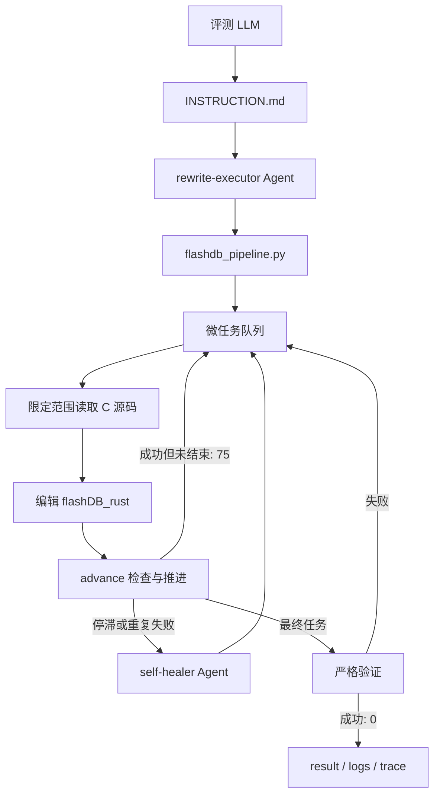
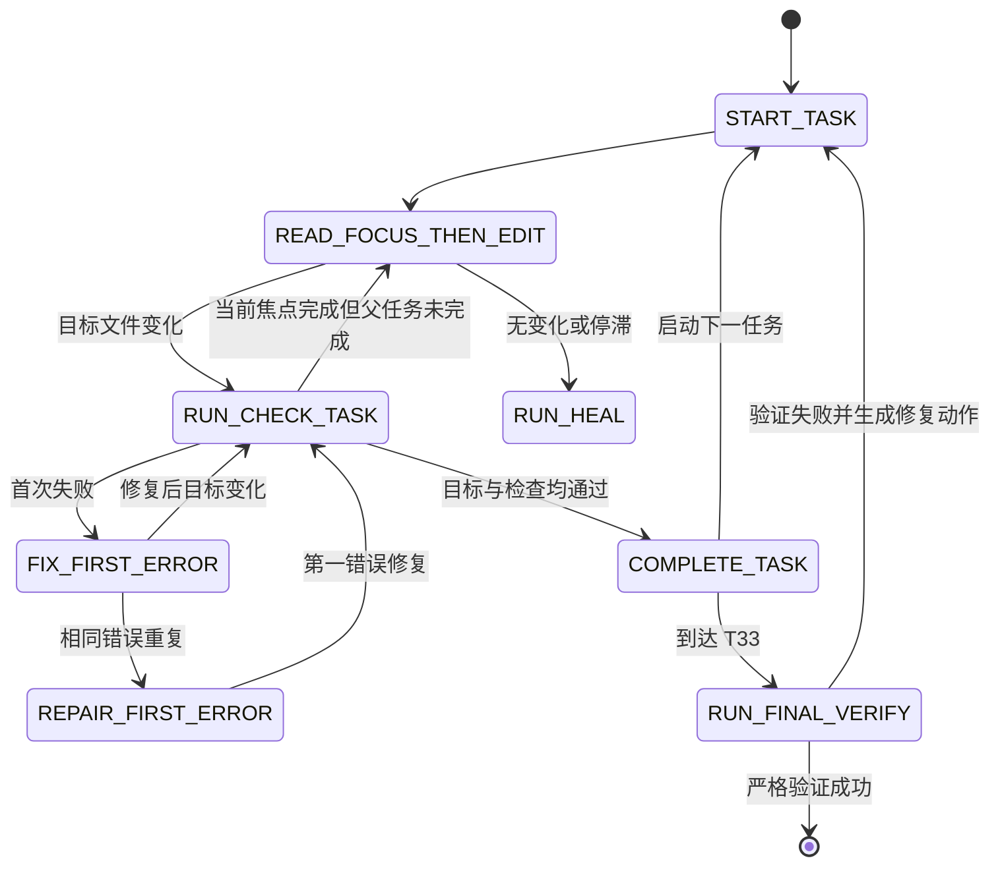

# FlashDB C 到 Rust 自动迁移工程说明

## 目录

1. [文档定位](#1-文档定位)
2. [工程目标](#2-工程目标)
3. [核心工程约束](#3-核心工程约束)
4. [总体架构](#4-总体架构)
5. [指导产物结构](#5-指导产物结构)
6. [运行时目录](#6-运行时目录)
7. [Rust 工程模块设计](#7-rust-工程模块设计)
8. [微任务系统](#8-微任务系统)
9. [生命周期状态机](#9-生命周期状态机)
10. [`advance` 加速机制](#10-advance-加速机制)
11. [自愈设计](#11-自愈设计)
12. [退出码与完成契约](#12-退出码与完成契约)
13. [标准执行流程](#13-标准执行流程)
14. [严格验证设计](#14-严格验证设计)
15. [参考执行结果](#15-参考执行结果)
16. [维护与扩展](#16-维护与扩展)
17. [故障排查](#17-故障排查)
18. [清理与重新执行](#18-清理与重新执行)
19. [已知边界与工程权衡](#19-已知边界与工程权衡)
20. [交付验收清单](#20-交付验收清单)

## 1. 文档定位

本文面向维护者、评审人员和需要二次开发流水线的工程师，详细说明本作品的目标、架构、状态机、自愈机制、加速策略、验证标准和维护方式。

评测 LLM 的唯一执行入口仍然是根目录的 `INSTRUCTION.md`。评测执行不需要把本文完整加载进上下文；本文用于工程审阅、问题定位和后续演进。

## 2. 工程目标

本作品的核心能力不是只依赖一份预先生成的 Rust 翻译结果，而是提供一套可由评测 LLM 自动执行的迁移系统。发布仓库可以附带一次完整执行结果作为验证样本，但评测仍应在提供的 FlashDB 原始仓库中按指导产物重新执行。系统完成以下工作：

1. 读取 `src/`、`inc/` 和 `tests/` 中的 C 材料，但不修改它们。
2. 在 `flashDB_rust/` 下生成可复现的 Rust 工程。
3. 将 KVDB、TSDB、文件后端、公共数据结构和低层辅助逻辑迁移为 Rust。
4. 将原始 C 测试迁移为 Rust 单元测试和集成测试，或提供行为等价覆盖。
5. 执行 `cargo build` 和 `cargo test`。
6. 检查测试映射、源码完整性和 `unsafe` 比例。
7. 在 `result/`、`logs/` 和 `log/trace/` 中生成可审计记录。

最终 Rust 工程必须至少具有以下结构：

```text
flashDB_rust/
  Cargo.toml
  Cargo.lock
  src/
  tests/
```

## 3. 核心工程约束

### 3.1 原始材料只读

以下目录属于评测输入，任何执行步骤都不得修改：

```text
src/
inc/
tests/
```

严格验证通过 `git diff -- src/ inc/ tests/` 检查这一约束。原始材料有任何差异，整个迁移都判定为失败。

### 3.2 全自动执行

执行过程不得依赖人工确认、交互式终端、手工复制文件或人工选择下一任务。评测 LLM 只需要：

- 运行流水线命令；
- 按流水线给出的精确范围读取 C 源码；
- 编辑指定 Rust 文件；
- 根据状态继续执行。

`logs/interaction/` 仅在确实发生人工交互时创建。正常自动执行中该目录应当不存在。

### 3.3 低上下文运行

系统针对上下文能力较弱的模型设计，禁止一次性加载完整的 `fdb_kvdb.c`、`fdb_tsdb.c` 或完整测试文件。流水线使用微任务、函数级焦点和紧凑续跑包控制单轮输入规模。

### 3.4 可复现交付

交付内容必须包含 Rust 源码、Cargo 配置、测试和执行记录。`flashDB_rust/target/` 属于可再生编译缓存，不是交付件，不应提交。

### 3.5 Rust 安全性

目标实现优先使用所有权、切片、枚举、`Result`、标准文件 API 和明确的数据结构。严格验证要求 Rust 源码中的 `unsafe` 行比例低于 10%；当前参考执行结果为 0%。

## 4. 总体架构



系统分为四层：

1. **执行契约层**：`INSTRUCTION.md` 定义环境、执行方式、完成判定和结果路径。
2. **方法层**：`work/skills/flashdb-rust-rewrite/SKILL.md` 定义迁移原则、模块映射和上下文规则。
3. **代理层**：执行 Agent 负责常规循环，自愈 Agent 负责在原任务内优化执行策略。
4. **确定性工具层**：`work/scripts/flashdb_pipeline.py` 维护任务、状态、检查、日志和最终验证。

## 5. 指导产物结构

清理转换结果后，作品应只保留以下指导产物以及原 FlashDB 仓库内容：

```text
INSTRUCTION.md
ENGINEERING_GUIDE.zh-CN.md
work/
  agents/
    rewrite-executor.md
    self-healer.md
  scripts/
    flashdb_pipeline.py
    verify.sh
  skills/
    flashdb-rust-rewrite/
      SKILL.md
```

各文件职责如下：

| 文件 | 职责 |
|---|---|
| `INSTRUCTION.md` | 评测 LLM 的权威入口和完成契约 |
| `ENGINEERING_GUIDE.zh-CN.md` | 面向维护者的详细设计说明 |
| `SKILL.md` | 迁移方法、模块映射、上下文策略和验证要求 |
| `rewrite-executor.md` | 常规执行循环、恢复规则和停止条件 |
| `self-healer.md` | 停滞诊断、焦点缩小和同周期续跑协议 |
| `flashdb_pipeline.py` | 无第三方 Python 依赖的任务与验证 CLI |
| `verify.sh` | Shell 形式的严格验证入口 |

## 6. 运行时目录

流水线执行后会生成以下目录：

```text
flashDB_rust/       Rust 源码、Cargo 配置和测试
work/state/         非语义执行状态和任务进度
result/             自验证记录与成功报告
logs/               可观察的过程事件
log/trace/          命令、编译和测试的完整输出
```

### 6.1 `work/state/`

该目录是可恢复执行的检查点，主要包含：

| 文件 | 内容 |
|---|---|
| `plan.json` | 完整微任务计划和当前任务 |
| `todo.md` | 面向模型的任务队列摘要 |
| `current_task.md` | 当前任务的完整执行说明 |
| `continue.json` | 必须继续执行的机器可读标记 |
| `completed_tasks.txt` | 已通过检查的任务缓存 |
| `healing_action.md` | 当前自愈动作的非语义说明 |
| `next_actions.md` | 验证失败后的修复清单 |
| `task_progress/*.json` | 单任务哈希、检查结果和焦点进度 |

状态文件只允许记录任务 ID、结构化源码范围、目标哈希、退出码、错误日志位置、时间戳和计数器。禁止写入 C 算法总结、翻译提示、伪代码、源码理解或隐藏推理过程。

### 6.2 `result/`

| 文件 | 生成时机 |
|---|---|
| `preflight.json` | 环境预检后 |
| `status.json` | 状态检查或验证后 |
| `verify.json` | 每次验证后 |
| `issues/00-summary.md` | 每次报告生成后 |
| `output.md` | 仅严格验证成功后 |

失败验证会删除陈旧的 `result/output.md`，避免评测系统把旧成功报告误认为当前成功。

### 6.3 日志目录

- `logs/process.jsonl`：记录可观察事件，例如任务启动、检查退出码、自愈类型和任务推进。
- `logs/interaction/`：仅记录真实人工交互，自动执行时不创建。
- `log/trace/`：保存 Cargo、编译器、测试和单任务检查的完整输出。

过程日志不得保存隐藏思维链。详细命令输出和模型决策记录严格分离。

## 7. Rust 工程模块设计

迁移后的 Rust 工程使用标准 Cargo 目录结构。C 到 Rust 的主要映射如下：

| C 材料 | Rust 模块 | 主要职责 |
|---|---|---|
| `inc/fdb_def.h` | `error.rs`、`def.rs`、`blob.rs` | 错误码、枚举、常量、Blob 和共享结构 |
| `inc/fdb_low_lvl.h` | `low_lvl.rs` | 对齐、状态表和底层状态写入 |
| `src/fdb_utils.c` | `utils.rs` | CRC32 等公共辅助逻辑 |
| `src/fdb_file.c` | `file_backend.rs` | 文件模式 Flash 读写、同步和擦除 |
| `src/fdb.c` | `db.rs` | 基础 DB 初始化、完成初始化和反初始化 |
| `src/fdb_kvdb.c` | `kvdb.rs` | KV 扫描、缓存、分配、GC、恢复和公共 API |
| `src/fdb_tsdb.c` | `tsdb.rs` | TSL 追加、迭代、时间查询、状态和清理 |
| `tests/fdb_kvdb_tc.c` | `tests/kvdb_test.rs` | KVDB 行为测试 |
| `tests/fdb_tsdb_tc.c` | `tests/tsdb_test.rs` | TSDB 行为测试 |

允许的 Rust 依赖保持最小化：

```toml
[dependencies]
crc32fast = "1.4"
bytemuck = "1.16"

[dev-dependencies]
tempfile = "3.10"
```

`Cargo.lock` 应随最终 Rust 项目交付，以提高复现稳定性。

## 8. 微任务系统

流水线内置 44 个顺序微任务，从 `T00-skeleton` 到 `T33-final-verify`。由于存在 `T06a`、`T17a`、`T18a`、`T18b`、`T28a`、`T28b`、`T29a`、`T29b`、`T31a` 和 `T31b` 等补充分段，任务数量大于编号跨度。

每个任务由结构化字段描述：

```python
{
    "id": "T08-kvdb-read-kv",
    "title": "Port KV address scan and read_kv",
    "read": ["src/fdb_kvdb.c:280-415"],
    "write": ["flashDB_rust/src/kvdb.rs"],
    "symbols": ["find_next_kv_addr", "get_next_kv_addr", "read_kv"],
    "check": "cargo check --manifest-path flashDB_rust/Cargo.toml",
    "max_read_lines": 150,
}
```

字段含义：

- `read`：本任务唯一允许读取的源码范围。
- `write`：允许编辑的目标文件。
- `symbols`：任务完成时必须存在的 Rust 符号。
- `done`：某些任务要求存在的完整文件。
- `check`：任务级确定性检查命令。
- `max_read_lines`：读取预算上限。

### 8.1 任务分层

| 阶段 | 任务范围 | 内容 |
|---|---|---|
| 工程骨架 | T00 | Cargo 工程和模块入口 |
| 公共类型与底层能力 | T01-T06a | 错误、定义、Blob、CRC、文件后端和 DB 基类 |
| KVDB | T07-T19 | 布局、读取、缓存、查找、分配、GC、恢复和公共 API |
| TSDB | T20-T27 | 布局、读取、追加、迭代、查询、清理和初始化 |
| KVDB 测试 | T28-T30 | 测试框架、基础行为、GC 和扩容 |
| TSDB 测试 | T31-T32 | 基础行为、时间查询、边界和回归测试 |
| 最终验证 | T33 | 严格构建、测试、覆盖和报告 |

### 8.2 完成判定

普通任务必须同时满足：

1. 目标文件存在且非空；
2. 指定完成符号存在；
3. 当前目标内容通过任务检查；
4. 检查后的目标哈希与当前哈希一致。

仅仅出现函数名不代表最终行为正确。符号检查负责快速推进，完整行为由迁移测试和最终严格验证兜底。

## 9. 生命周期状态机

`next_required_action()` 根据任务状态返回以下动作之一：

| 动作 | 含义 |
|---|---|
| `START_TASK` | 初始化任务状态和目标哈希 |
| `READ_FOCUS_THEN_EDIT` | 读取当前授权范围并立即编辑 |
| `RUN_CHECK_TASK` | 目标已变化，应运行任务检查 |
| `COMPLETE_TASK` | 目标和检查均已满足，可登记完成 |
| `FIX_FIRST_ERROR` | 检查失败，只修复第一处错误 |
| `REPAIR_FIRST_ERROR` | 重复错误已进入自愈修复模式 |
| `RUN_HEAL` | 当前状态无法安全推进，需要自愈 |
| `RUN_FINAL_VERIFY` | 执行最终严格验证 |



## 10. `advance` 加速机制

`advance` 是推荐的生命周期入口：

```bash
python3 work/scripts/flashdb_pipeline.py advance TASK_ID
```

它将原先需要多次调用的流程合并为一次状态转换：

```text
check-task -> complete-task -> start-task(next) -> task(next)
```

`advance` 会根据当前状态自动执行以下操作：

- 未启动：启动当前任务；
- 已编辑：运行任务检查；
- 检查通过：登记当前任务完成；
- 存在下一任务：自动启动下一任务；
- 到达 T33：直接运行严格验证；
- 没有目标变化：跳过无意义的 Cargo 调用并触发自愈；
- 检查失败：只向模型输出第一段有效错误，完整输出写入 trace。

### 10.1 紧凑续跑包

生命周期命令默认只输出类似以下内容：

```text
CONTINUE 75
task=T08-kvdb-read-kv
focus=T08-kvdb-read-kv.F-find_next_kv_addr-get_next_kv_addr
action=READ_FOCUS_THEN_EDIT
read=src/fdb_kvdb.c:280-346
write=flashDB_rust/src/kvdb.rs
symbols=find_next_kv_addr,get_next_kv_addr
next=python3 work/scripts/flashdb_pipeline.py advance T08-kvdb-read-kv
details=work/state/current_task.md
```

这能显著降低弱模型反复接收完整任务说明造成的上下文消耗。完整说明仍保存在 `work/state/current_task.md`，需要诊断时可运行：

```bash
python3 work/scripts/flashdb_pipeline.py task --full
```

### 10.2 完成状态缓存

已通过检查的任务 ID 写入 `work/state/completed_tasks.txt`。常规执行只扫描第一个未完成的队列前沿，不再每次重读全部 44 个任务对应的目标文件。

缓存用于提升执行速度，不替代最终验证。即使后续编辑破坏了先前模块，最终 `cargo test`、必需符号检查和模块质量检查仍会发现问题。

### 10.3 测试检查分层

- 生产代码微任务主要运行 `cargo check`。
- 测试框架和辅助函数任务使用 `cargo test --no-run`，只验证编译。
- 单一 GC 场景使用精确测试过滤。
- 模块行为边界和最终任务运行完整测试。

这样既保留快速反馈，也确保最终结果经过完整测试。

## 11. 自愈设计

自愈不是新建一次迁移、清空上下文后重头执行，也不是归档失败尝试。它必须：

1. 保留当前父任务；
2. 保留已经完成的 Rust 代码；
3. 保留已完成任务记录；
4. 优化当前焦点；
5. 立即回到同一执行周期继续编辑。

### 11.1 诊断类型

| 诊断 | 触发条件 | 策略 |
|---|---|---|
| `proactive-context-guard` | 大任务首次读取前超过主动聚焦阈值 | 预先拆成结构化函数焦点 |
| `no-target-change` | 启动或推进后目标文件未变化 | 跳过 Cargo，缩小当前焦点 |
| `stale-no-progress` | 已启动任务至少 5 分钟无目标变化 | 重建焦点并续跑 |
| `repeated-check-failure` | 同一错误指纹连续出现两次 | 禁止重读 C，只修第一处编译错误 |
| `check-passed-objective-incomplete` | Cargo 成功但完成符号仍缺失 | 聚焦缺失符号 |
| `read-budget-too-large` | 当前任务超过读取预算 | 切分结构范围 |
| `untracked-stall` | 存在未完成任务但没有进度状态 | 从当前任务建立恢复状态 |

### 11.2 焦点生成

流水线通过函数名和花括号深度机械定位 C 函数定义。它不解析或保存函数语义。

关键参数：

```text
普通自愈切片上限:       90 行
主动聚焦阈值:          120 行
相邻函数合并上限:       80 行
单焦点最多合并符号:      2 个
停滞检测时间:           300 秒
```

例如 T08 的三个函数会形成两个 67 行焦点：

```text
src/fdb_kvdb.c:280-346 -> find_next_kv_addr + get_next_kv_addr
src/fdb_kvdb.c:348-414 -> read_kv
```

如果已合并焦点再次出现无修改停滞，下一代自愈会关闭相邻打包，进一步缩小到单函数。

### 11.3 重复错误识别

任务检查对第一条有效错误计算 SHA-256 指纹。相同指纹连续两次出现后，策略切换为 `repair-first-error`：

- 不允许再次读取 C 源码；
- 只读取当前任务 trace 中第一段错误；
- 修复后恢复原符号焦点；
- 完整错误输出仍保留在 `log/trace/`。

## 12. 退出码与完成契约

| 退出码 | 语义 |
|---|---|
| `0` | 命令本身成功；只有严格验证的 0 表示迁移完成 |
| `1` | 预检、验证或底层检查失败 |
| `2` | 命令参数或任务 ID 错误 |
| `75` | 中间动作成功，必须立即继续执行 |

退出码 75 是整个低上下文协议的关键。它既不是完成，也不是致命失败。收到 75 后，评测 LLM 必须读取 `work/state/continue.json` 和当前任务，并执行 `next_action`。

`continue.json` 只有在以下命令严格成功时才会被清除：

```bash
python3 work/scripts/flashdb_pipeline.py verify --strict
```

在 Shell 包装中使用 `set -e` 时，应显式允许退出码 75，否则 Shell 会错误地提前终止迁移。

## 13. 标准执行流程

评测路径固定为：

```text
/app/code/judge-assets/02_02_c_to_rust/code/FlashDB
```

脚本本身不硬编码此路径，而是通过 `flashdb_pipeline.py` 的文件位置推导仓库根目录，因此也可在本地检出中运行。

### 13.1 环境准备

```bash
cd /app/code/judge-assets/02_02_c_to_rust/code/FlashDB
python3 work/scripts/flashdb_pipeline.py preflight
python3 work/scripts/flashdb_pipeline.py init
python3 work/scripts/flashdb_pipeline.py plan
```

所需工具：

- Python 3；
- Rust stable，建议 1.70 或更高；
- Cargo；
- POSIX Shell；
- Git，用于原始材料完整性检查。

不需要 Docker、MCP Server、后台服务、网络访问或人工安装流程。

### 13.2 迁移循环

```bash
python3 work/scripts/flashdb_pipeline.py advance
```

随后重复：

1. 读取紧凑包或 `current_task.md`；
2. 只读取 `read=` 指定的 C 范围；
3. 编辑 `write=` 指定的 Rust 文件；
4. 运行 `advance TASK_ID`；
5. 若返回 75，立即继续；
6. 若返回第一处错误，只修复该错误；
7. 若自愈生效，执行新焦点，不重新做项目发现。

### 13.3 最终验证

当队列到达 T33 时，`advance` 会自动运行严格验证。也可以显式执行：

```bash
python3 work/scripts/flashdb_pipeline.py verify --strict
```

## 14. 严格验证设计

严格验证检查以下项目：

1. 根目录 `INSTRUCTION.md` 存在；
2. 运行记录目录可用；
3. `flashDB_rust/Cargo.toml` 存在；
4. 10 个预期 Rust 模块存在且非占位实现；
5. 两个 Rust 集成测试文件存在；
6. 测试函数体不是明显空壳；
7. `cargo build` 退出 0；
8. `cargo test --no-fail-fast` 退出 0；
9. 至少观察到 24 个测试；
10. 24 个映射的 FlashDB 行为用例全部存在；
11. `unsafe` 行比例低于 10%；
12. 原始 C 材料没有 Git 差异；
13. 成功报告和问题摘要可生成。

### 14.1 模块质量检查

模块质量门禁检查：

- 文件存在；
- 文件不是空文件；
- 不包含 `TODO`、`todo!`、`unimplemented!`、`placeholder` 等占位标记；
- KVDB 和 TSDB 的关键公共 API 符号齐全；
- 核心模块不应小到明显无法覆盖目标 API。

### 14.2 测试映射

测试映射覆盖 KVDB 13 类行为和 TSDB 11 类行为，包括：

- 初始化和反初始化；
- Blob 和字符串增删改；
- 两种 GC 场景；
- KVDB 扩容和恢复默认值；
- TSDB 追加、正向迭代、时间迭代和计数；
- TSL 状态更新和清理；
- 扇区边界时间查询；
- GitHub issue 249 回归行为。

## 15. 参考执行结果

最近一次完整执行的严格验证记录如下：

| 指标 | 结果 |
|---|---|
| `cargo build` | PASS |
| `cargo test` | PASS |
| 测试总数 | 85 |
| 映射用例 | 24/24 |
| Rust 源码行 | 4140 |
| `unsafe` 行 | 0 |
| `unsafe` 比例 | 0.00% |
| 原始材料完整性 | PASS |
| 未解决问题 | 0 |

85 个测试由以下部分组成：

- 58 个库内单元测试；
- 16 个 KVDB 集成测试；
- 11 个 TSDB 集成测试。

该结果用于说明当前流水线能够完成端到端迁移，不替代评测环境中的再次执行和严格验证。

## 16. 维护与扩展

### 16.1 新增微任务

在 `MICRO_TASKS` 中新增任务时，应满足：

1. ID 唯一且保持顺序；
2. `read` 使用精确的 `path:start-end`；
3. 目标读取预算不超过 200 行；
4. `write` 只包含必要目标；
5. `symbols` 能机械判断完成；
6. `check` 尽可能窄，但必须具有确定性；
7. 与相邻任务没有模糊的所有权重叠。

新增后至少运行：

```bash
python3 -m py_compile work/scripts/flashdb_pipeline.py
python3 work/scripts/flashdb_pipeline.py plan
```

### 16.2 新增 Rust 模块

需要同步更新：

- `EXPECTED_MODULES`；
- `flashDB_rust/src/lib.rs` 初始化模板；
- `REQUIRED_SYMBOLS`，如果模块具有必须 API；
- `MICRO_TASKS`；
- 本文的模块映射表；
- 最终验证预期。

### 16.3 新增测试场景

需要同步更新：

- `EXPECTED_CASES`；
- 对应测试微任务；
- 测试文件的完成符号；
- 映射总数和文档说明。

测试名可以与 C 测试入口不同，但必须通过映射符号明确建立等价关系。

### 16.4 修改状态格式

状态格式变更必须保持向后兼容，或者增加显式版本字段。焦点打包使用 `focus_pack_version`，用于识别旧状态并安全升级，而不是删除整个任务进度。

### 16.5 修改 Skill

`SKILL.md` 应保持精炼，只保留评测 LLM 必须执行的流程。详细工程背景应继续放在本文，不要复制进 Skill，避免占用上下文。

修改 Skill 后运行：

```bash
python3 /path/to/skill-creator/scripts/quick_validate.py \
  work/skills/flashdb-rust-rewrite
```

## 17. 故障排查

| 现象 | 原因 | 处理方式 |
|---|---|---|
| 命令返回 75 后执行停止 | 控制器把续跑码当失败 | 读取 `continue.json` 并立即执行 `next_action` |
| 模型反复压缩上下文 | 当前任务或输出过大 | 使用紧凑包，运行 `heal`，只读新焦点 |
| 多次运行 Cargo 但文件未改 | 缺少目标变化门禁 | 使用 `advance`，它会跳过 Cargo 并自愈 |
| 同一编译错误重复 | 模型在错误间来回切换 | 进入 `repair-first-error`，只修第一处错误 |
| Cargo 成功但任务不完成 | 完成符号缺失 | 按缺失符号继续当前焦点 |
| `result/output.md` 不存在 | 严格验证尚未成功 | 查看 `result/verify.json` 和 `next_actions.md` |
| `logs/interaction/` 不存在 | 自动执行没有人工交互 | 这是预期行为，不要创建空目录 |
| 任务队列跳过旧任务 | 完成缓存生效 | 最终严格验证仍会检查完整工程 |
| 原始材料完整性失败 | `src/`、`inc/` 或 `tests/` 被修改 | 恢复原始材料，只在 `flashDB_rust/` 编辑 |
| 测试在其他机器无法运行 | 编译缓存或锁文件不一致 | 删除 `target/`，保留 `Cargo.lock`，运行 `cargo test --locked` |

## 18. 清理与重新执行

需要恢复为“仅指导产物”状态时，只删除生成目录：

```bash
rm -rf flashDB_rust result logs log work/state work/scripts/__pycache__
```

不得删除：

```text
INSTRUCTION.md
ENGINEERING_GUIDE.zh-CN.md
work/agents/
work/scripts/flashdb_pipeline.py
work/scripts/verify.sh
work/skills/
src/
inc/
tests/
```

清理后重新执行 `preflight`、`init`、`plan` 和 `advance` 即可开始全新迁移。

## 19. 已知边界与工程权衡

### 19.1 结构定位不是完整 C AST

函数焦点通过正则、函数名和花括号深度定位，优点是零第三方依赖、速度快、可在受限环境运行。复杂宏生成函数或非常规 C 语法可能需要回退到任务原始范围切片。

### 19.2 符号存在不等于行为正确

微任务使用符号检查实现快速反馈，可能无法识别语义错误。因此最终行为必须由集成测试、完整 Cargo 测试和用例映射共同保证。

### 19.3 完成缓存可能过期

同一 Rust 文件会被多个后续任务继续编辑，理论上可能破坏已完成逻辑。缓存只优化日常扫描，不参与最终成功判定。

### 19.4 自愈不能替代实现

自愈负责发现停滞、缩小输入和切换修复策略，不会替模型生成隐藏的算法理解，也不会通过保存源码总结绕过上下文限制。模型仍需在当前焦点内完成真实代码编辑。

### 19.5 日志可审计但不保存思维链

工程保留命令输出、退出码、状态变化和任务事件，用于复现和排障；不记录不可验证的内部推理。这是可审计性和模型隐私之间的明确边界。

## 20. 交付验收清单

提交最终结果前确认：

- [ ] 根目录存在 `INSTRUCTION.md`；
- [ ] 指导文件能在无人工交互情况下驱动执行；
- [ ] 原始 `src/`、`inc/`、`tests/` 没有修改；
- [ ] `flashDB_rust/Cargo.toml` 存在；
- [ ] Rust `src/` 和 `tests/` 完整；
- [ ] `cargo build` 成功；
- [ ] `cargo test` 成功；
- [ ] 24 个映射行为全部覆盖；
- [ ] `unsafe` 比例低于 10%；
- [ ] `result/output.md` 仅在成功后存在；
- [ ] `result/issues/00-summary.md` 已生成；
- [ ] `logs/process.jsonl` 和 `log/trace/` 可审计；
- [ ] `logs/interaction/` 仅在真实交互发生时存在；
- [ ] `work/state/continue.json` 已由严格成功验证清除；
- [ ] 未提交 `flashDB_rust/target/` 编译缓存；
- [ ] 最终交付路径清晰且可由评测 LLM 自动找到。

完成判定始终以以下命令退出 0 为准：

```bash
python3 work/scripts/flashdb_pipeline.py verify --strict
```
