# 推荐问句模块架构

## 整体流程

```mermaid
flowchart TD
    %% ═══════════════════════════════════════════════
    %% 第一阶段：上下文构建
    %% ═══════════════════════════════════════════════
    IN["📥 上游输入<br/>查询意图 + 用户原文 + 设备/子部件<br/>指标/时间/告警 + 拒答信息"]

    IN --> R1{"上游是否返回<br/>结构化拒答？"}
    R1 -- 否 --> R2{"LLM 是否有拒答原因？"}
    R1 -- 是 --> R3["根据错误码确定恢复策略"]
    R2 -- 无拒答 --> R4["不设定恢复策略<br/>（正常推荐）"]
    R2 -- 有拒答 --> R5["设定为基础引导"]
    R3 --> R6["根据失效规则标记无效值<br/>（如找不到 IP、指标不存在）"]
    R4 --> R7["组装推荐上下文"]
    R5 --> R6
    R6 --> R7

    R7 --> CTX["📋 推荐上下文<br/>查询意图 / 用户原文 / 设备列表<br/>子部件 / 指标 / 时间 / 子网范围<br/>告警 / 聚合方式 / 关联表<br/>恢复策略 / 拒答详情 / 无效值"]

    %% ═══════════════════════════════════════════════
    %% 第二阶段：能力候选召回
    %% ═══════════════════════════════════════════════
    CTX --> LOAD1["加载逻辑表元数据<br/>（有表名时从 YAML 读取）"]
    LOAD1 --> LOAD2["加载能力卡片<br/>（从本地 JSON 缓存）"]
    LOAD2 --> RECALL["🔍 召回候选能力"]

    RECALL --> P0{"用户查询意图<br/>是否已识别？"}

    P0 -- 未识别 --> PATH_A["❓ 自由探索路径"]
    P0 -- 已识别 --> P1{"是否处于<br/>拒答恢复状态？"}
    P1 -- 是 --> PATH_B["🔄 拒答引导路径"]
    P1 -- 否 --> PATH_C["🎯 精准匹配路径"]

    PATH_A --> A1{"上下文中有<br/>设备或子部件？"}
    A1 -- 有 --> A2["按设备/子部件类型<br/>筛选匹配的查询领域"]
    A1 -- 无 --> A3["从用户原文中<br/>智能识别设备/子部件"]
    A2 --> A4{"匹配到的领域类型？"}
    A3 --> A4
    A4 -- 告警/链路/子网 --> A5["推荐特殊类问句"]
    A4 -- 子部件 --> A6["推荐子部件信息/统计/指标问句"]
    A4 -- 普通设备 --> A7["推荐设备信息/统计/指标问句"]

    PATH_B --> B1["从用户原文中<br/>推断查询方向"]
    B1 --> B2["生成匹配方向的候选<br/>+ 相邻相关候选"]
    B2 --> B3{"指标类候选<br/>全部无匹配？"}
    B3 -- 是 --> B4["放宽指标匹配条件<br/>补充更多候选"]
    B3 -- 否 --> DONE["✅ 候选生成完成"]
    B4 --> DONE

    PATH_C --> C1["按设备/子部件类型<br/>精确筛选查询领域"]
    C1 --> C2["确定主查询类型<br/>（见下方路由规则）"]
    C2 --> C3["生成主候选<br/>+ 相邻相关候选<br/>+ 特殊类候选"]
    C3 --> DONE

    A5 --> DONE
    A6 --> DONE
    A7 --> DONE

    %% ═══════════════════════════════════════════════
    %% 第三阶段：评分排序与筛选
    %% ═══════════════════════════════════════════════
    DONE --> DEDUPE["去除重复候选"]
    DEDUPE --> EMPTY{"候选列表为空？"}
    EMPTY -- 是 & 基础恢复 --> FALLBACK["🛟 启用全局兜底<br/>从所有领域生成<br/>设备信息查询 + 设备数量统计"]
    EMPTY -- 其他 --> SCORE["为每个候选打分"]
    FALLBACK --> SCORE

    SCORE --> RANK["按分数从高到低排序"]
    RANK --> DIVERSE["多样性筛选<br/>同类型 + 同设备 + 同子部件<br/>最多保留 2 条<br/>取总分最高的前 12 条"]

    %% ═══════════════════════════════════════════════
    %% 第四阶段：LLM 生成
    %% ═══════════════════════════════════════════════
    DIVERSE --> PROMPT["组装 Prompt<br/>推荐上下文 + 候选能力列表<br/>+ 逻辑表结构"]
    PROMPT --> LLM["🤖 调用大语言模型<br/>生成推荐问句"]
    LLM --> PARSE["解析返回结果"]
    PARSE --> VALID{"返回格式有效？"}
    VALID -- 有效 --> OUT["✅ 输出 3 条推荐问句<br/>+ 面向用户的解释说明"]
    VALID -- 无效 --> EMPTY_OUT["❌ 返回空结果"]

    %% ═══════════════════════════════════════════════
    %% 样式
    %% ═══════════════════════════════════════════════
    classDef phase fill:#1a1a2e,color:#fff,stroke:#333,stroke-width:2px
    classDef entry fill:#2563eb,color:#fff,stroke:#1d4ed8,stroke-width:2px
    classDef ctx fill:#16a34a,color:#fff,stroke:#15803d,stroke-width:2px
    classDef decision fill:#f59e0b,color:#000,stroke:#d97706,stroke-width:2px
    classDef process fill:#0891b2,color:#fff,stroke:#0e7490,stroke-width:1px
    classDef pathA fill:#7c3aed,color:#fff,stroke:#6d28d9,stroke-width:1px
    classDef pathB fill:#dc2626,color:#fff,stroke:#b91c1c,stroke-width:1px
    classDef pathC fill:#059669,color:#fff,stroke:#047857,stroke-width:1px
    classDef outOk fill:#16a34a,color:#fff,stroke:#15803d,stroke-width:2px
    classDef outEmpty fill:#6b7280,color:#fff,stroke:#4b5563,stroke-width:2px
    classDef fallback fill:#f97316,color:#fff,stroke:#ea580c,stroke-width:1px
    classDef llm fill:#8b5cf6,color:#fff,stroke:#7c3aed,stroke-width:2px

    class IN entry
    class CTX ctx
    class R1,R2,P0,P1,A1,A4,B3,EMPTY,VALID decision
    class LOAD1,LOAD2,R3,R4,R5,R6,R7,A2,A3,B1,B2,C1,C2,C3,DEDUPE,SCORE,RANK,DIVERSE,PROMPT,PARSE process
    class PATH_A,A5,A6,A7 pathA
    class PATH_B,B4 pathB
    class PATH_C pathC
    class OUT outOk
    class EMPTY_OUT,FALLBACK fallback
    class LLM llm
    class RECALL process
```

## 主查询类型路由规则

根据**查询意图** + **上下文特征**确定主查询类型：

| 查询意图 | 条件 | 主查询类型 |
|---------|------|----------|
| 查告警 | — | 告警查询 |
| 查链路 | — | 链路查询 |
| 查信息 | 涉及子网对象 | 子网资源查询 |
| 查指标 | 无子部件 | 设备指标查询 |
| 查指标 | 有子部件 | 子部件指标查询 |
| 查信息 | 无统计聚合 | 设备信息查询 / 子部件信息查询 |
| 查信息 | 有统计聚合 | 设备数量统计 / 子部件数量统计 |

## 候选评分维度

每个候选的最终分数由以下维度累加：

| 维度 | 加分 | 说明 |
|-----|-----|------|
| 主类型完全匹配 | +160 | 候选类型 = 主查询类型 |
| 设备类型匹配 | +120 | 候选设备类型 ∩ 上下文设备类型 |
| 子部件类型匹配 | +100 | 子部件种类吻合 |
| 指标名称匹配 | +60 | KPI 名称吻合 |
| 属性名称匹配 | +40 | 属性名称吻合 |
| 逻辑表元数据命中 | +30 | 表名/字段名在候选提示中出现 |
| 静态优先级 | 可变 | 能力卡片的固有优先级 |

排序后取前 **12 条**，且同查询类型 + 同设备 + 同子部件的组合最多保留 **2 条**，保证推荐多样性。

## 恢复策略说明

当上游返回拒答信息时，模块根据错误码选择不同的恢复策略：

| 策略 | 含义 | 典型场景 |
|------|------|---------|
| **基础引导** | 常规推荐 | SQL 生成失败、字段检索失败 |
| **追问补全** | 引导用户补充缺失信息 | 缺少查询对象/指标/时间范围 |
| **歧义消解** | 引导用户在多个选项中明确意图 | 设备名/IP/指标存在多个候选 |
| **剔除无效** | 从上下文中移除无法识别的信息 | 设备找不到、指标不存在 |
| **简化查询** | 推荐更简单的问法 | SQL 执行报错、引擎错误 |
| **调整范围** | 调整查询范围（如时间跨度） | 查询超时 |
