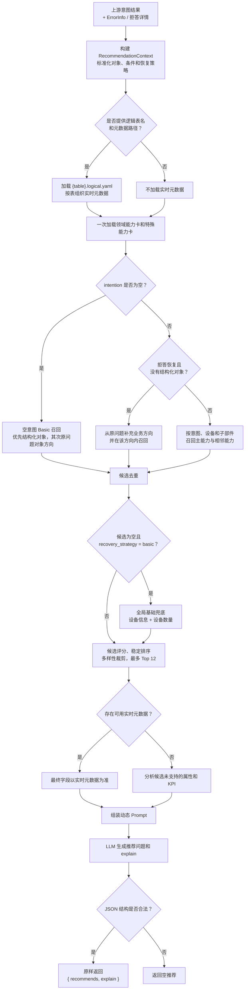

# 问题推荐逻辑

## 逻辑图

## 规格描述

### 输入与输出

| 项目 | 规格 |
|---|---|
| 上游输入 | 意图结果、用户原问题、设备条件、子部件、属性、KPI、时间、告警、聚合、逻辑表名 |
| 拒答输入 | 共享 `ErrorInfo` 决定恢复策略；LLM 拒答详情仅辅助最终表达 |
| 标准上下文 | `RecommendationContext`，只保留推荐实际使用的数据 |
| 设备条件 | `DeviceCondition(device_id, id_type, match_mode, device_type)`，保持定位值与设备类型的对应关系 |
| 实时元数据 | 从 `{table_name}.logical.yaml` 读取表描述和字段描述，按表组织 |
| 输出 | `{"recommends": [...], "explain": "..."}`；结构合法时原样返回 |

### 能力规格

| 类型 | 描述 |
|---|---|
| 领域能力卡 | 定义业务域、设备类型与别名、定位方式、属性、指标、子部件、表提示和示例 |
| 六类通用能力 | `device_info`、`device_count`、`device_metric`、`subcomponent_info`、`subcomponent_count`、`subcomponent_metric` |
| 特殊能力 | 告警、链路、子网资源和资源关系等六类通用能力之外的能力 |
| 字段边界 | 有实时元数据时以实时元数据为准；无实时元数据时以候选能力的 `properties` 和 `metrics` 为准 |

### 推荐表达约束

- 支持查信息、查告警、查指标、查链路。
- 支持列表、数量、字段聚合、趋势和 TopN。
- 不推荐同比、环比、较上期、较同期等跨周期对比及其派生增长率、变化率或增减幅。
- 推荐不得突破候选能力的对象、父子关系和业务方向，不得继承 `invalid_values`。
- `explain` 包含当前查询、当前原因和下一步方向，并使用用户友好的业务表达。

## 推荐逻辑

### 1. 上下文与恢复策略

`build_recommendation_context(...)` 将上游结果转换为最小上下文。恢复策略仅由稳定错误码确定：

| 策略 | 行为 |
|---|---|
| `basic` | 常规基础引导；无候选时允许全局基础兜底 |
| `clarify` | 推荐补齐关键对象、指标、时间或条件的问题 |
| `disambiguate` | 推荐明确业务域、设备类型或查询方向的问题 |
| `remove_invalid` | 移除已确认无效的设备定位值或 KPI |
| `simplify` | 删除部分复杂条件后重新查询 |
| `adjust_scope` | 调整对象范围或时间范围 |

### 2. 主能力路由

| 意图与条件 | 主能力 |
|---|---|
| 查告警 | 告警特殊能力 |
| 查链路 | 链路特殊能力 |
| 查信息 + 子网对象 | 子网资源特殊能力 |
| 查信息 + 无子部件 + 非 count | `device_info` |
| 查信息 + 无子部件 + count | `device_count` |
| 查指标 + 无子部件 | `device_metric` |
| 查信息 + 有子部件 + 非 count | `subcomponent_info` |
| 查信息 + 有子部件 + count | `subcomponent_count` |
| 查指标 + 有子部件 | `subcomponent_metric` |

空 `intention` 时不执行上述主路由，改用 Basic 召回：优先结构化对象；没有结构化对象时，从原问题匹配设备、子部件或特殊对象方向。

### 3. 候选生成与过滤

1. 按设备类型或子部件匹配领域能力卡；设备类型、别名和字段匹配忽略英文字母大小写。
2. 生成主能力候选，并补充同对象的相邻能力与兼容特殊能力。
3. 设备定位方式不兼容、父子对象不兼容或 KPI 未命中指标能力时，不生成对应候选。
4. 空意图 Basic 会召回信息、数量和指标方向；候选为空且 `recovery_strategy=basic` 时，才使用全局设备信息和数量兜底。
5. 候选按 `capability_id` 去重。

### 4. 评分与选择

| 匹配项 | 分数 |
|---|---:|
| 主能力类型匹配 | +160 |
| 设备类型匹配 | +120 |
| 子部件类型匹配 | +100 |
| KPI 匹配 | +60 |
| 属性匹配 | +40 |
| 逻辑表或元数据提示匹配 | +30 |
| 能力卡静态优先级 | 直接计入 |

候选按总分、静态优先级和 `capability_id` 稳定排序。同一“能力类型 + 设备类型 + 子部件类型”最多保留 2 条，最终最多向 LLM 提供 12 条候选。

### 5. 字段选择与 LLM 表达

- 有可用实时元数据：具体属性和指标由相关对象的实时字段描述决定。
- 无可用实时元数据：确定性分析原属性和 KPI 是否至少被一个最终候选支持，并将所有候选均未支持的查询项传给 Prompt。
- 动态 Prompt 由核心规则、恢复策略、子网/元数据场景片段、候选能力和字段分析组成。
- LLM 负责生成推荐问题和自然化 `explain`；解析器只校验 `recommends: list[str]` 与 `explain: str`，不做内容过滤或补足。
