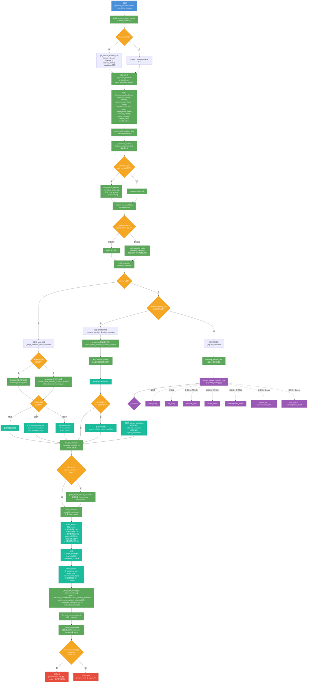

# question_recommendation 模块流程

```mermaid
flowchart TD
    %% ── 入口 ──
    A["上游输入<br/>upstream_result + ErrorInfo + llm_refuse_message"]
    A --> B["build_recommendation_context<br/>(context_builder.py)"]

    %% ── 上下文构建 ──
    B --> B1{"refuse_info 存在?"}
    B1 -- 是 --> B2["get_refusal_recovery_rule<br/>(refusal_rules.py)<br/>error key → recovery_strategy<br/>+ invalidation 规则"]
    B1 -- 否 --> B3["recovery_strategy = basic 或 空"]
    B2 --> B4["解析失效值<br/>all_device_identifiers<br/>ip_identifiers / name_identifiers / all_kpis"]
    B3 --> B4
    B4 --> B5["构建 RecommendationContext<br/>intention · question · devices[]<br/>subcomponent_types · subnet<br/>properties · kpis · time · alarm<br/>aggregations · tables<br/>recovery_strategy<br/>refusal_message · refusal_detail<br/>invalid_values"]

    %% ── 推荐调用入口 ──
    B5 --> C["recommend_questions_chat<br/>(recommender.py)"]
    C --> C0["_normalize_context<br/>RecommendationContext 或兼容字典"]
    C0 --> C1{"tables 非空且<br/>path_provider 存在?"}
    C1 -- 是 --> C2["load_logical_metadata<br/>(metadata_loader.py)<br/>读取 *.logical.yaml<br/>→ MetadataTable[]"]
    C1 -- 否 --> C3["metadata_tables = []"]
    C2 --> D["recommend_capabilities<br/>(capabilities.py)"]
    C3 --> D

    %% ── 能力召回主流程 ──
    D --> D1{"domain_cards &<br/>special_cards 已注入?"}
    D1 -- 全部注入 --> D2["使用已注入卡片"]
    D1 -- 部分或无 --> D3["load_capability_cards<br/>(capability_loader.py)<br/>读取 JSON 并补齐缺失卡片"]
    D2 --> E["recall_candidates<br/>(capability_recall.py)"]
    D3 --> E

    %% ── 召回三路分支 ──
    E --> E1{"intention 为空?"}
    E1 -- 是 --> E1a["空意图 Basic 路径<br/>_empty_intention_basic_candidates"]
    E1 -- 否 --> E2{"recovery_strategy 非空<br/>且无结构化对象?"}

    E1a --> E1b{"有结构化设备<br/>或子部件?"}
    E1b -- 是 --> E1c["按结构化对象匹配领域卡<br/>matching_domain_cards"]
    E1b -- 否 --> E1d["从 question 文本识别对象<br/>domain_cards_matching_question_direction<br/>subcomponents_matching_text"]
    E1c --> E1e{"匹配到特殊卡<br/>或子部件?"}
    E1d --> E1e
    E1e -- 特殊卡 --> E1f["生成特殊能力候选"]
    E1e -- 子部件 --> E1g["生成 subcomponent_info /<br/>subcomponent_count /<br/>subcomponent_metric"]
    E1e -- 领域卡 --> E1h["生成 device_info /<br/>device_count /<br/>device_metric"]
    E1f --> F
    E1g --> F
    E1h --> F

    E2 -- 是 --> E2a["拒答方向收敛路径<br/>_recovery_question_direction_candidates"]
    E2 -- 否 --> E3["常规召回路径<br/>_regular_candidates"]

    E2a --> E2b["从 question 匹配领域方向<br/>domain_cards_matching_question_direction"]
    E2b --> E2c["构造 direction_context<br/>注入识别到的设备/子部件"]
    E2c --> E2d["生成主候选 + 相邻候选"]
    E2d --> E2e{"主骨架为指标且<br/>KPI 全部未命中?"}
    E2e -- 是 --> E2f["放宽 KPI 屏蔽<br/>_append_relaxed_metric_candidates"]
    E2e -- 否 --> F
    E2f --> F

    E3 --> E3a["matching_domain_cards<br/>设备/子部件硬过滤"]
    E3a --> E3b["resolve_primary_capability_type<br/>(capability_routing.py)"]
    E3b --> E3c{"主骨架路由"}
    E3c --> E3d["主候选 primary_candidates<br/>+ 相邻候选 adjacent_candidates<br/>+ 特殊候选 special_candidates"]

    E3d --> F

    %% ── 主骨架路由细节 ──
    E3b -.-> |"查告警"| RT1["alarm_query"]
    E3b -.-> |"查链路"| RT2["link_query"]
    E3b -.-> |"查信息 + 子网对象"| RT3["resource_query"]
    E3b -.-> |"查指标 + 无子部件"| RT4["device_metric"]
    E3b -.-> |"查指标 + 有子部件"| RT5["subcomponent_metric"]
    E3b -.-> |"查信息 + 无count"| RT6["device_info / subcomponent_info"]
    E3b -.-> |"查信息 + 有count"| RT7["device_count / subcomponent_count"]

    %% ── 去重 → 兜底 → 评分 → 裁剪 ──
    F["dedupe_candidates<br/>(capability_matching.py)<br/>去除重复候选"]
    F --> F1{"候选为空且<br/>recovery_strategy == basic?"}
    F1 -- 是 --> F2["global_basic_fallback_candidates<br/>全局领域卡 device_info + device_count"]
    F1 -- 否 --> G
    F2 --> G
    G["rank_candidates<br/>(capability_ranking.py)<br/>计算 match_score"]

    G --> G1["match_score =<br/>基础 priority<br/>+ 主骨架匹配 160<br/>+ 设备类型匹配 120<br/>+ 子部件类型匹配 100<br/>+ KPI 名称匹配 60<br/>+ 属性名称匹配 40<br/>+ 元数据提示命中 30"]

    G1 --> H["排序<br/>1. match_score 降序<br/>2. priority 降序<br/>3. capability_id 字典序"]

    H --> I["select_diverse<br/>同 (capability_type,<br/>device_type, subcomponent_type)<br/>分组最多保留 2 个<br/>→ Top 12"]

    %% ── LLM 组装与调用 ──
    I --> J["_build_chat_messages<br/>(recommender.py)<br/>system: QUESTION_RECOMMENDATION_SYSTEM_PROMPT<br/>user: recommendation_context JSON<br/>+ candidate_capabilities JSON<br/>+ metadata_tables JSON"]

    J --> K["llm_chat_client(messages)<br/>调用 Chat LLM"]

    K --> L["_parse_llm_response<br/>解析纯 JSON / Markdown JSON / 杂文 JSON"]

    L --> L1{"recommends: list[str]<br/>explain: str<br/>结构合法?"}
    L1 -- 是 --> M["返回结果<br/>{recommends: [3条推荐],<br/>explain: 用户友好说明}"]
    L1 -- 否 --> N["返回空结果<br/>{recommends: [], explain: ''}"]

    %% ── 样式 ──
    classDef entryNode fill:#4A90D9,stroke:#2C5F8A,color:#fff
    classDef processNode fill:#5BA85B,stroke:#3D7A3D,color:#fff
    classDef decisionNode fill:#F5A623,stroke:#C47D0E,color:#fff
    classDef routeNode fill:#9B59B6,stroke:#6C3483,color:#fff
    classDef dataNode fill:#1ABC9C,stroke:#148F77,color:#fff
    classDef outputNode fill:#E74C3C,stroke:#B03A2E,color:#fff
    classDef scoreNode fill:#3498DB,stroke:#2471A3,color:#fff

    class A entryNode
    class B,B4,B5,C,C0,C2,C3,D,D2,D3,E,E1c,E1d,E2b,E2c,E3a,F,F2,G,J,K,L processNode
    class B1,C1,D1,E1,E1b,E1e,E2,E2e,F1,L1 decisionNode
    class E3b,E3c,RT1,RT2,RT3,RT4,RT5,RT6,RT7 routeNode
    class E1f,E1g,E1h,E2d,E2f,E3d,G1,H,I dataNode
    class M,N outputNode
    class scoreNode scoreNode
```
